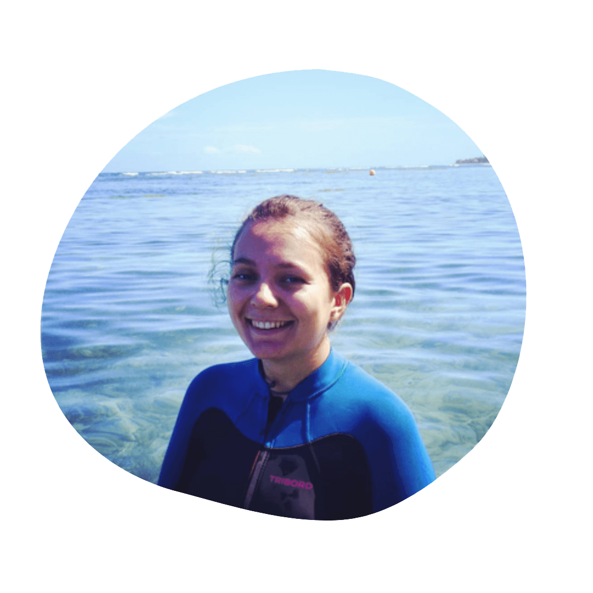
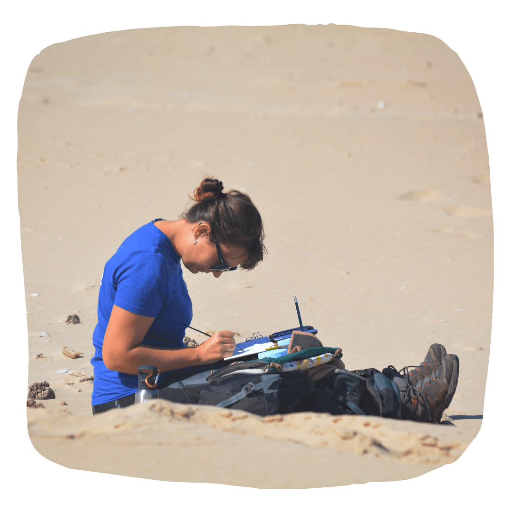
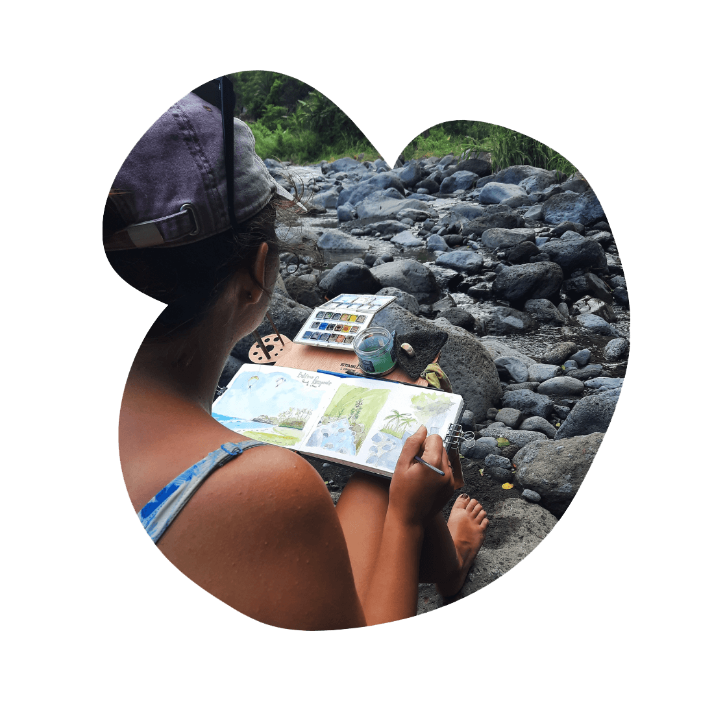

---
date: "2016-05-05T21:48:51-07:00"
title: Qui suis-je ?
--- 
 

Coucou !   Moi c’est Marion, scientifique, couturière et aquarelliste et ce que j'aime plus que tout, c'est satisfaire ma curiosité et ma soif d'apprendre ! 

 

  

   
  

   

      

      J'ai commencé à peindre à l'acrylique tôt a coté de ma grand-mère peintre, couturière et cuisinière (je crois que c'est de famille les multiples hobbies 😇). Et puis avec mes études scientifiques, j'ai laissé mon coté créatif de coté, avec l'idée un peu bête qu'on était soit scientifique soit artistique (merci les préjugées du lycée).  
  
C'est finalement pendant ma thèse de doctorant que j'ai éprouvé le besoin de me reconnecter avec moi-même et d'exprimer cette créativité qui me manquait au quotidien. J'ai recommencé doucement avec un bullet journal (bujo pour les intimes) et quelques godets d'aquarelles. 
  
En parallèle, j'exprime aussi ma créativité en cousant ma garde robe et je suis fière de dire que je n'ai acheté aucun vêtement neuf depuis 4 ans !
      

      

   

  

 

 
Je partage l'ensemble de mes créations sur Instagram, alors abonne-toi si le coeur y est !  
 
 

<a href="https://www.instagram.com/seas_sewing/">
     <button class="btn_poupre">Me suivre sur Intagram </button></a>

  
<h1 style="  color:  #436f77;
  font-family: Georgia;
  font-style: italic;
  font-size: 200%" > Pourquoi l'aquarelle ? </h1>
 

  

   
  

   

      

      L'aquarelle est un medium qui à l'air facile au premier abord mais on se rends bien vite compte que ce n'est pas le cas ! Il faut penser à laisser les blancs et à l'inverse de l'acrylique faut peindre les zones claires avant les foncées. Penser aux mélanges, au séchage, etc.  Mais c'est ça la beauté de l'aquarelle, on ne peut pas tout maîtrise et faut lâcher prise !  
  
On retrouve l'aquarelle en tube ou en godet, et ces derniers sont très pratique quand on voyage ! 
      

      

   

  

  
<h1 style="  color:  #436f77;
  font-family: Georgia;
  font-style: italic;
  font-size: 200%" > Mes perspectives pour l'atelier des embruns </h1>
 

  

   
  

   

      

      Actuellement mon travail m’amène à bouger beaucoup et déménager souvent. Je n'ai pas encore trouver la meilleure solution pour faire vivre sereinement l'atelier (avoir du stock par exemple). 
        Mais dans un futur proche j'aimerais réussir à :

      <ul style="color: #a20c4c">
         <li> Vendre mes aquarelles sous format de cartes postales et posters </il>
         <li> Faire du design textile en imprimant mes motifs sur du tissus </il>
      </ul>
      

          Si vous souhaitez soutenir mon travail et acheter mes aquarelles vous pouvez prendre contact avec moi via Instagram et Facebook 😃
      

      

   

  

