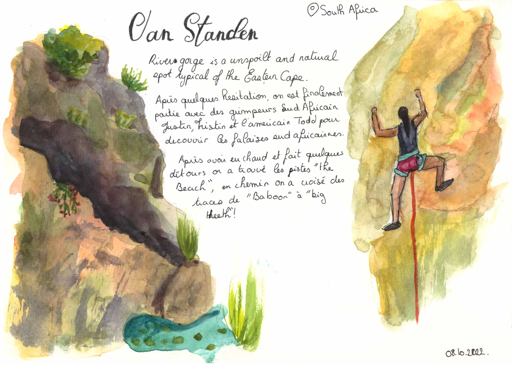
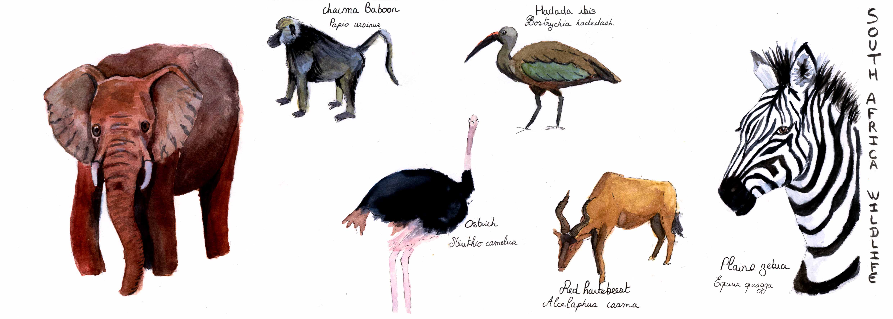
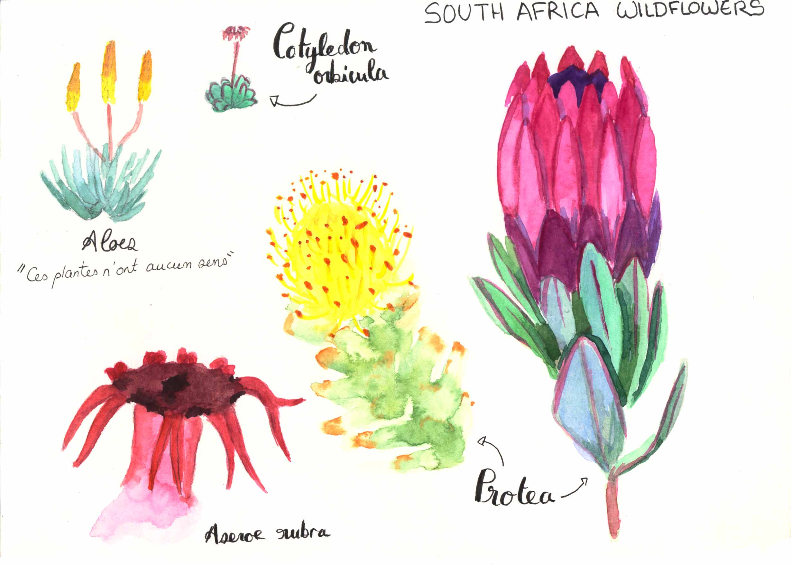

 
Découvrez mon carnet de voyage peint à l'aquarelle en Afrique du Sud. 
 
A l'occasion du 14ème symposium du WIOMSA, j'ai eu l'occasion d'aller en Afrique du Sud à Port-Elizabeth. Une semaine enrichissante et pleine de découverte.

 
 

  

    

      

        

      
Cape Recife Natural Reserve

    

    

      

        

      
Spot d'escalade à Van Standen

    

        

      

        

      
Faunes sauvages rencontrées en safari

    

    

      

        

      
Fleurs sauvages

    

  

