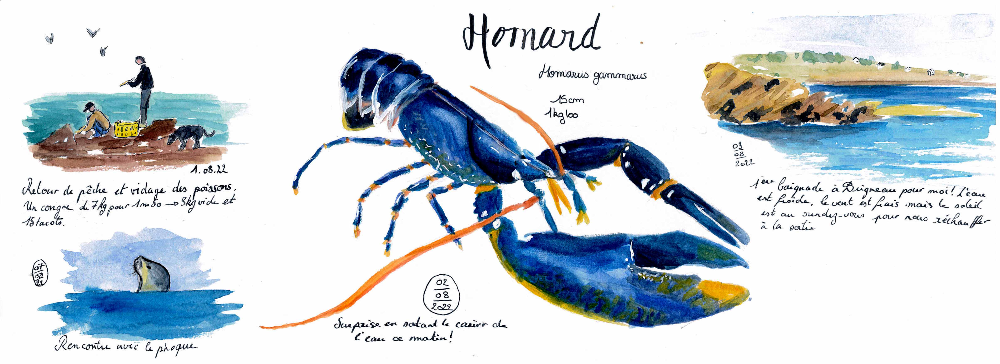
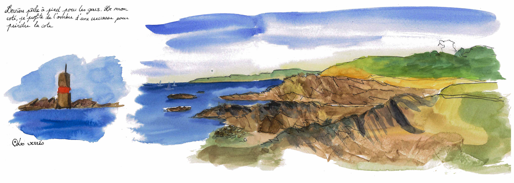
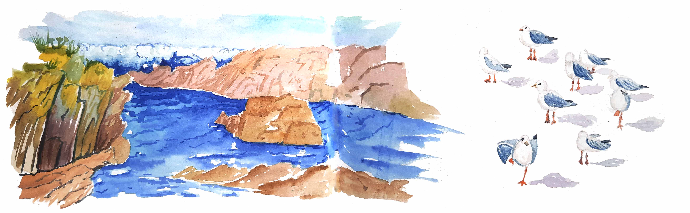
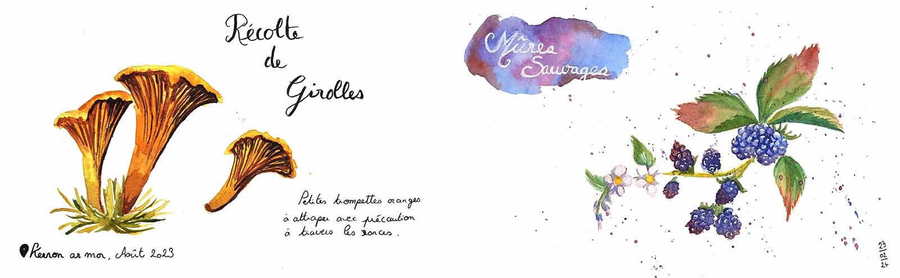
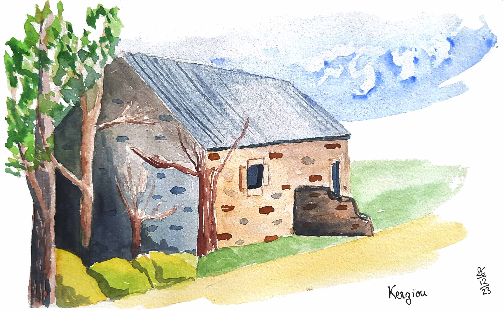
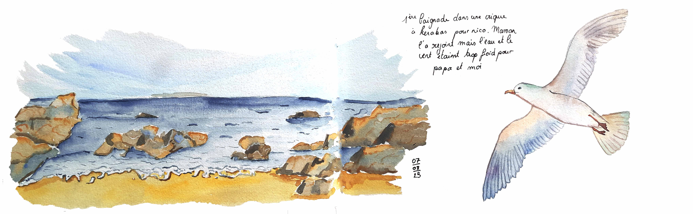

 
Explorez mon carnet de voyage peint à l'aquarelle de la Bretagne et du Finistère Sud. Chaque page évoque la beauté des paysages marins et mon amour pour cette région unique.
 
Depuis ma petite enfance, je passe mes étés à contempler la mer de ce joli petit coin de Bretagne. Maintenant, je peux l'emmener avec moi dans mes carnets. 

 
 

  

    

      

        

      
Matin de retour de pêche

    

    

      

        

      
Les Vérres depuis le chemin côtier

    

    

      

        

      
Digue de Brigneau vue depuis le chemin côtier de Malachape
  
    

    

      

        

      
Aquarelle rapide à la plage
  
    

    

      

        

      
Cueillette dans les bois
  
    

    

      

        

      
Maisonnette abandonnée à Kerziou

    

    

      

        

      
Quand l'eau est trop froide on peut toujours la peindre
  
    

  

