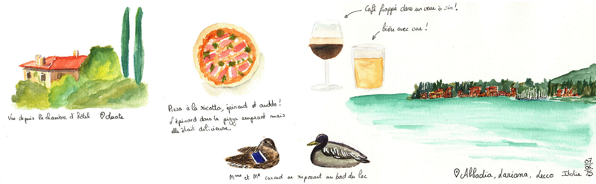
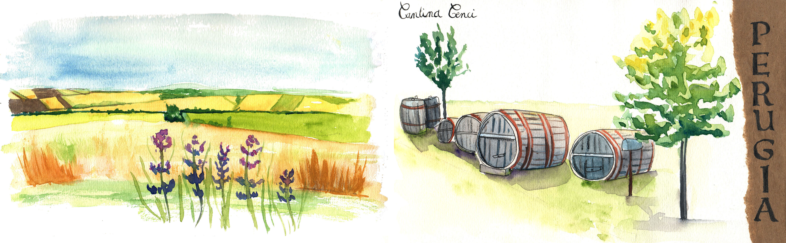
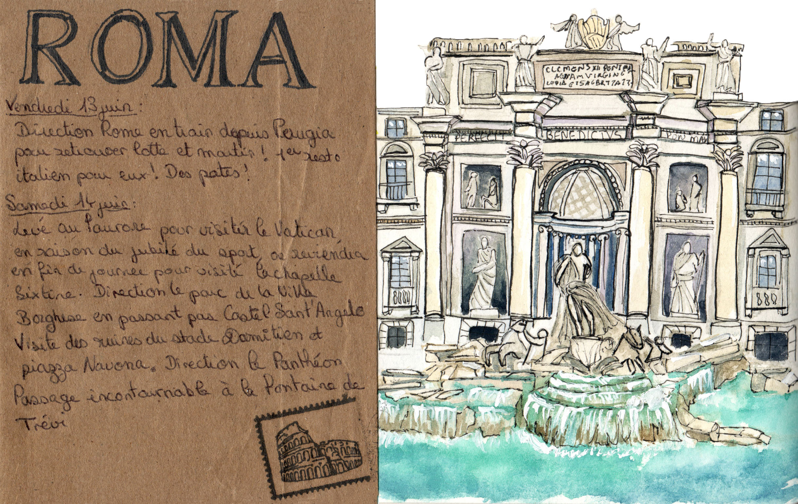
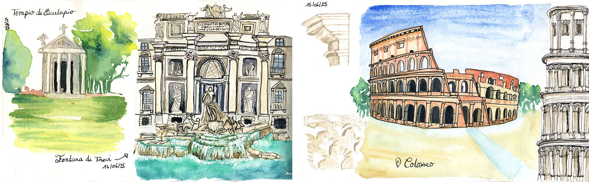

  
<h1 style="color:#C2274B; font-family: Georgia;font-size: 150%">Juin 2025 ~ Une semaine au coeur de l'Italie</h1>

Souvenirs d'une semaine à la décourerte de l'Italie. Découvrez la beauté italienne à travers mon carnet de voyage qui immortalisent ses paysages verdoyants et son architecture unique.

 
 

  

    

      

        

      
A la découverte de Merate et Lecco avec une promenade au bord du lac de Côme

    

   

        

           

        
Repas gastronomique au seins du vignoble ombrien 

    

     

          

            

          
Week-end à Rome

        

    

       

          

         
Déambulation dans les rues de Rome

    

