
 
La Réunion, l'île intense, dés que l'on mets le nez dehors, il y a quelques choses à peindre. Alors lorsque l'on s'enfonce dans les paysages sauvages, le plus dur c'est de choirir quel plan peindre.  
 
Explorez mon carnet de voyage peint à l'aquarelle de l'ile de La Réunion. Chaque page évoque la beauté des paysages sauvages et les couleurs chatoyantes de cette île unique.
 
 

<h1 style="color:#C2274B; font-family: Georgia;font-size: 150%">Le Nord</h1>

  

  

      

        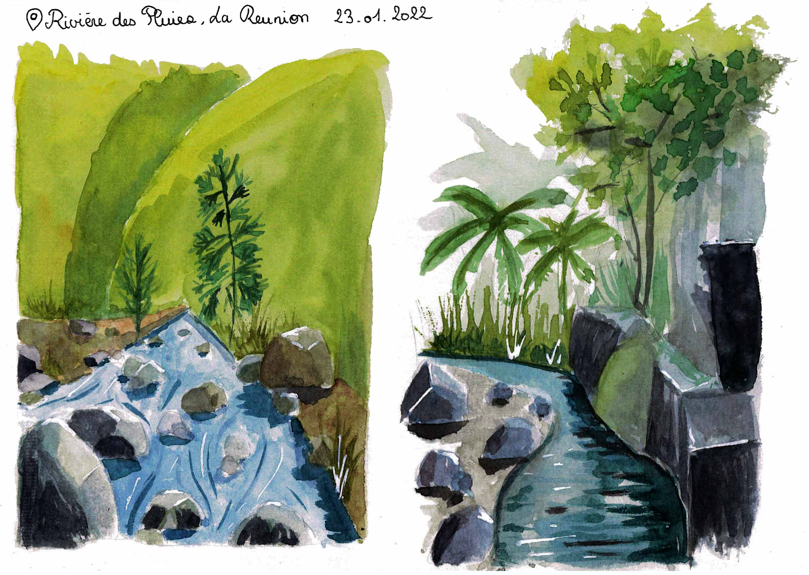

      
Rivière des Pluies

    

    

      

        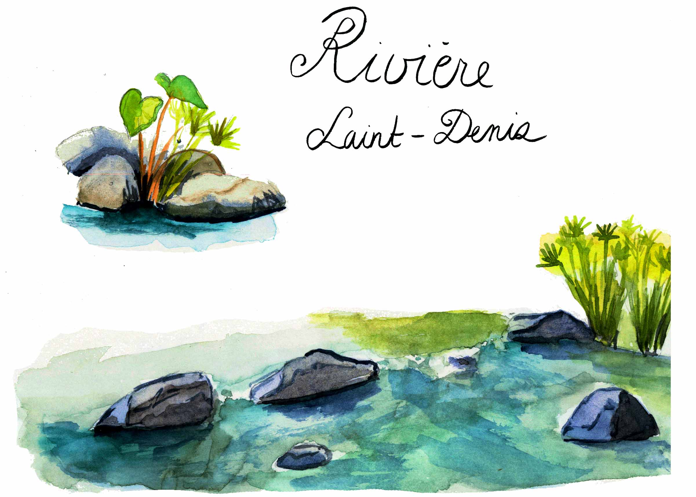

      
Rivière Saint Denis

    

    

      

        

          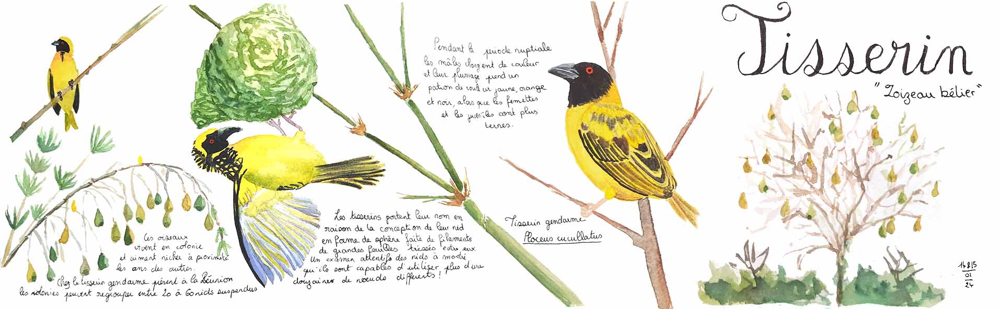

        
Balais des oiseaux tisserins confectionnant leurs nids

      

 

 

<h1 style="color:#C2274B; font-family: Georgia;font-size: 150%">L'Ouest</h1>

  

    

      

        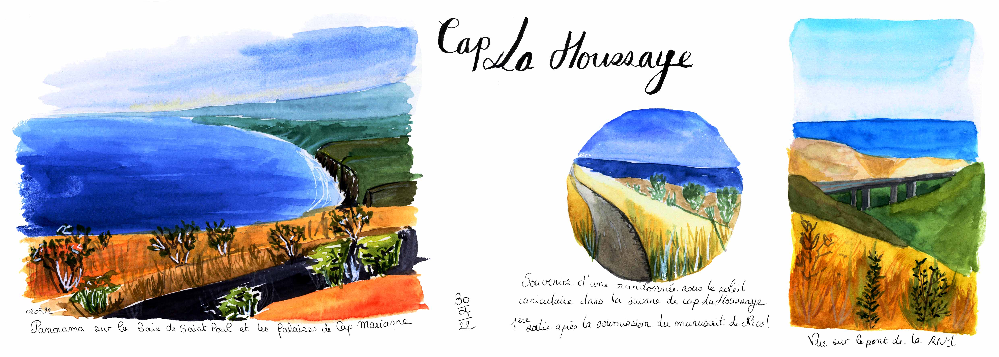

      
La savane de Cap la Houssaye

    

      

    

      

        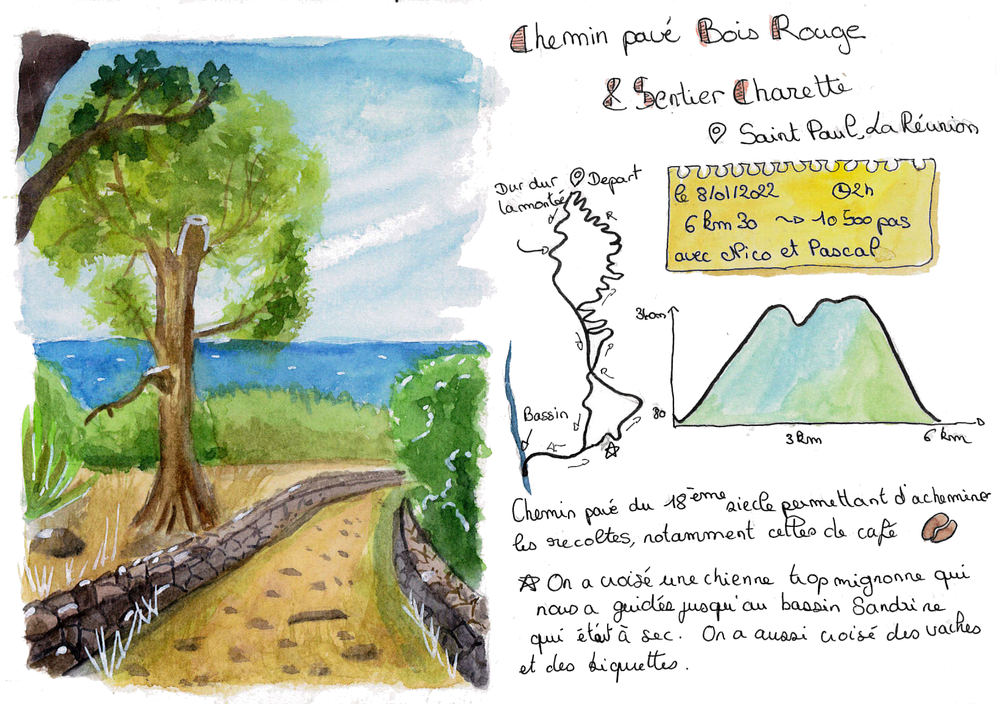

      
Randonnée au chemin pavé de Bois Rouge

    

     

      

        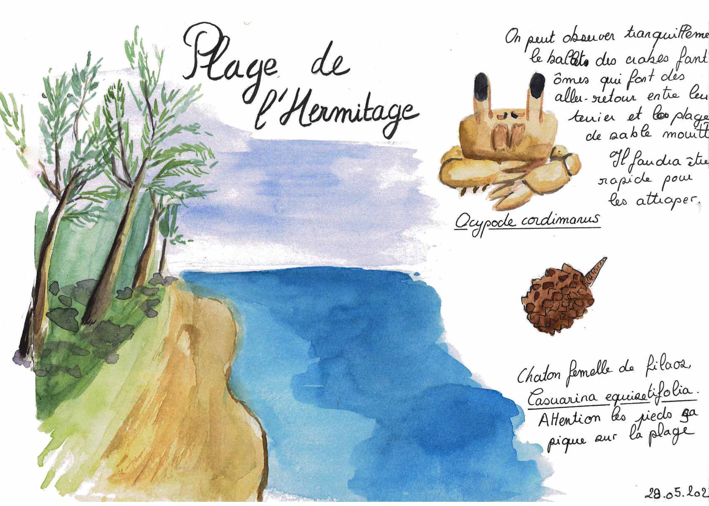

      
Plage de l'Hermitage

    

 

<h1 style="color:#C2274B; font-family: Georgia;font-size: 150%">L'Est, la côte sous le vent</h1>

  

    

      

        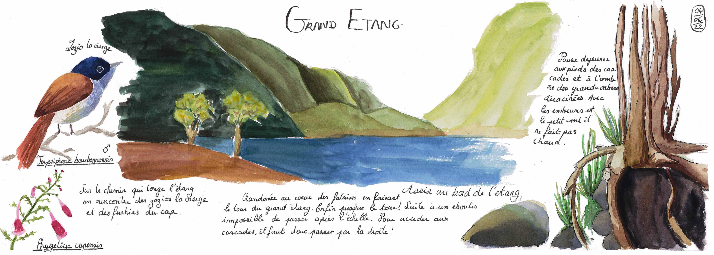

      
Prommenade au tour du Grand Etang

    

   

   

      

        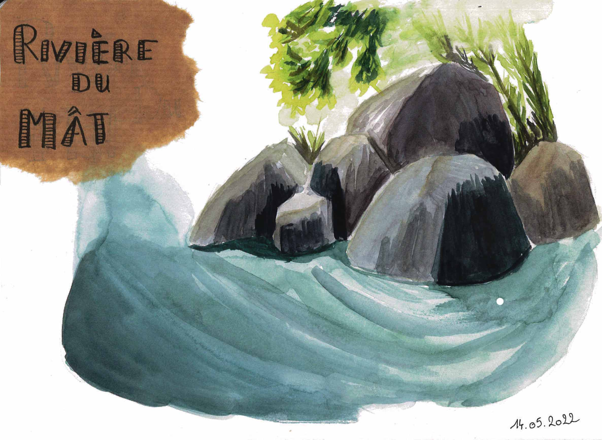

      
Rivière du Mât

    

 

<h1 style="color:#C2274B; font-family: Georgia;font-size: 150%">Le Sud sauvage</h1>

  

    

      

        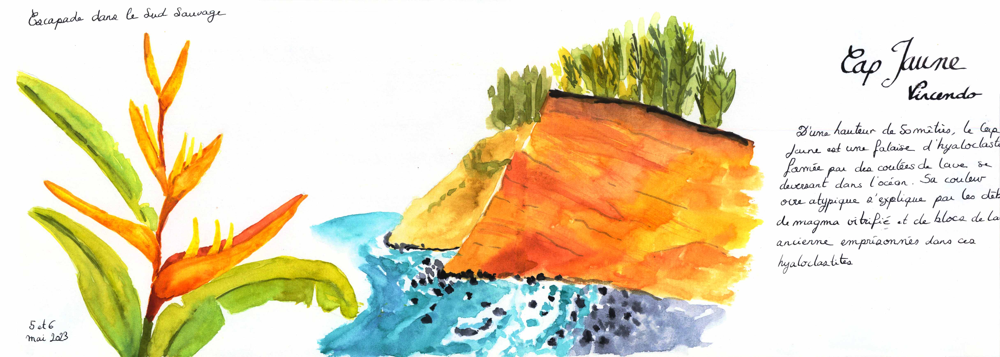

      
Les falaises de Cap Jaune

    

  

 
<h1 style="color:#C2274B; font-family: Georgia;font-size: 150%">Les cirques</h1>

  

    

      

        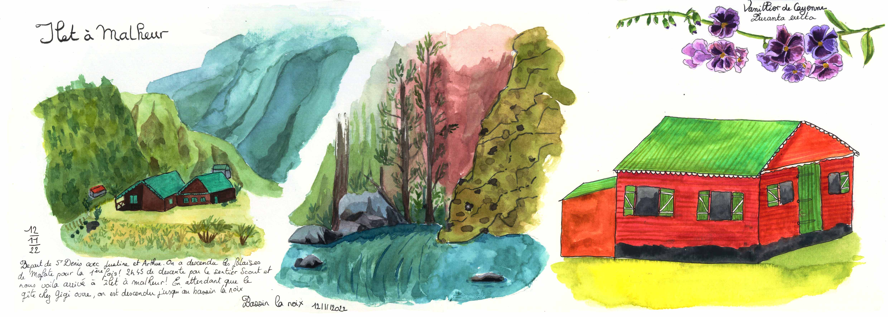

      
Mafate ~ Ilet à Malheur

    

    

      

        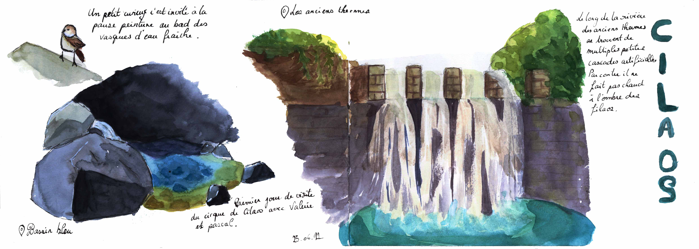

      
Cilaos ~ Bassin Bleu

    

    

      

        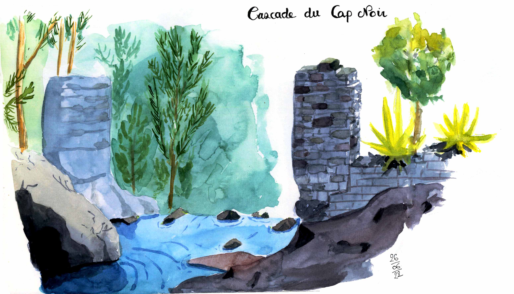

      
Cilaos ~ Bassin de Cap Noir

    

    

      

        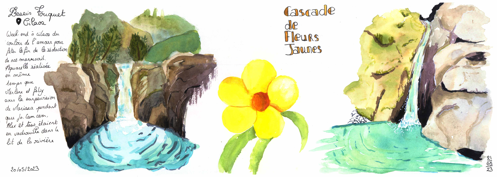

      
Week-end à Cilaos

    

