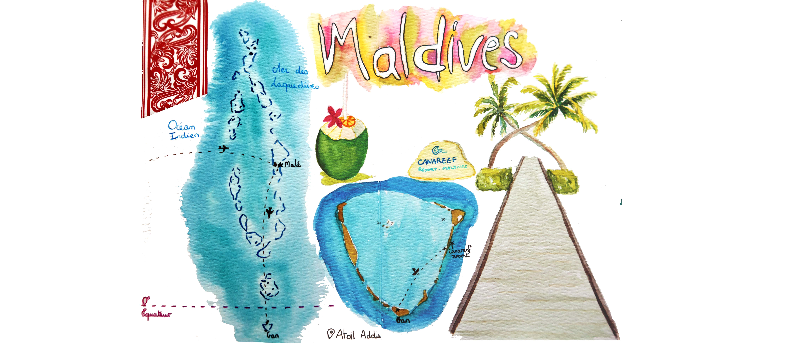
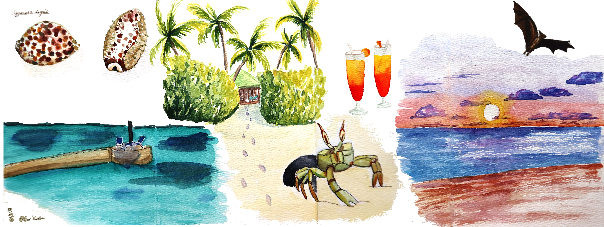

  
<h1 style="color:#C2274B; font-family: Georgia;font-size: 150%">Avril 2025 ~ Lune de miel aux Maldives</h1>

Souvenirs de notre voyage de noces au sud des Maldives sur l'atol Addu. Découvrez la beauté de ces iles à travers mon carnet de voyage qui immortalisent les eaux turquoises et la végétation verdoyantes de cet écrin de beauté.

 
 

  

    

      

        

      
Arrivée au resort au sud des Maldives

    

    

      

        

      
Résumé illustré d'une journée typique des vacances avec baignade et cocktail au couché de soleil 

    

  

<h1 style="color:#C2274B; font-family: Georgia;font-size: 150%"></h1>

