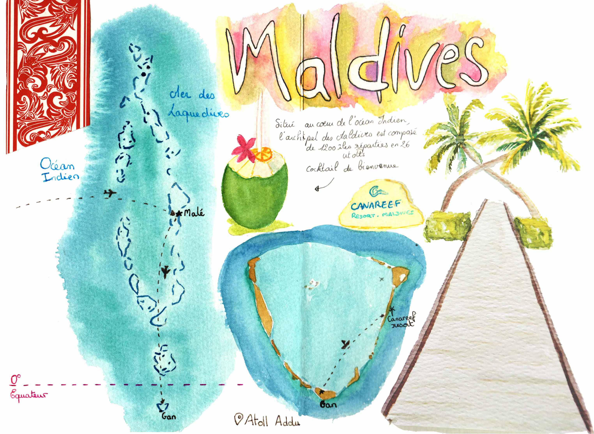
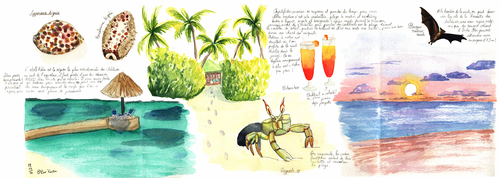
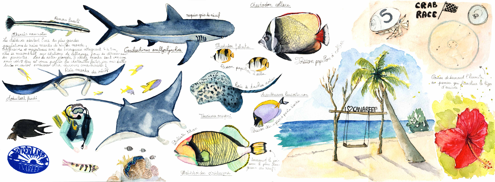
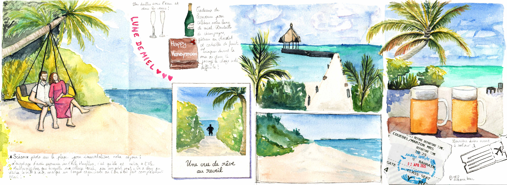

  
<h1 style="color:#C2274B; font-family: Georgia;font-size: 150%">Avril 2025 ~ Lune de miel aux Maldives</h1>

Souvenirs de notre voyage de noces au sud des Maldives sur l'atol Addu. Découvrez la beauté de ces iles à travers mon carnet de voyage qui immortalisent les eaux turquoises et la végétation verdoyantes de cet écrin de beauté.

 
 

  

    

      

        

      
Recto de mon carnet dépliant

    

    

      

        

      
Et le verso 

    

    

      

        

      
Arrivée à Canareef resort à l'atol Addu 

    

    

      

        

      
Résumé illustré d'une journée typique des vacances avec baignade et cocktail au couché de soleil 

    

    

      

        

      
A la découverte de la vie sous-marine. On a eu la chance de rencontrer les Raies Manta 

    

    

      

        

      
Les Maldives et ses plages de sables blancs 

    

  

<h1 style="color:#C2274B; font-family: Georgia;font-size: 150%"></h1>

