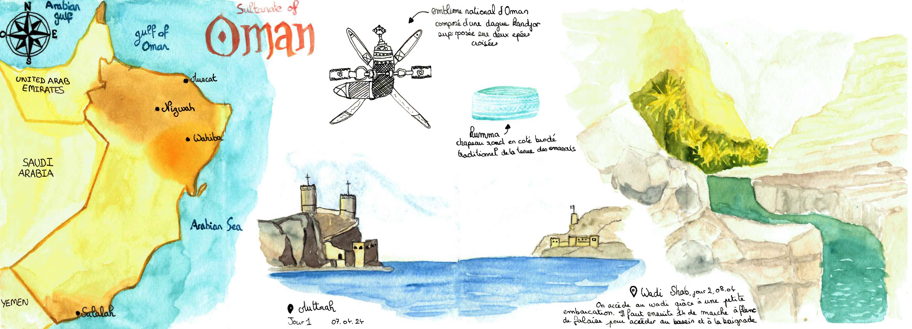
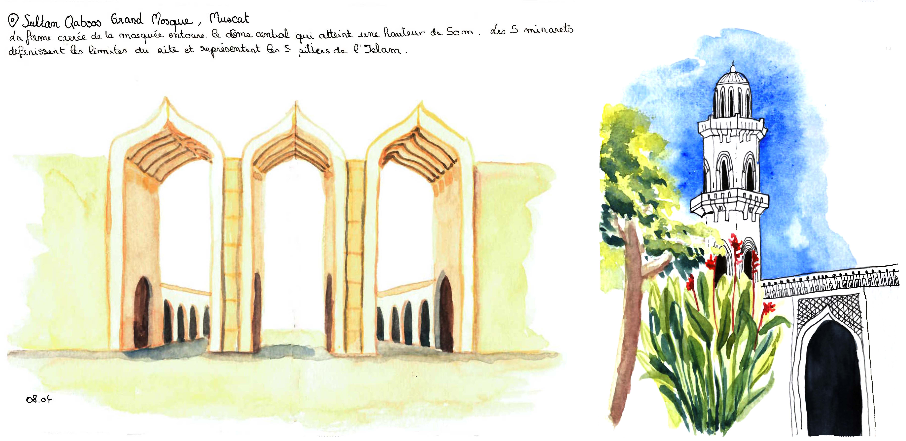
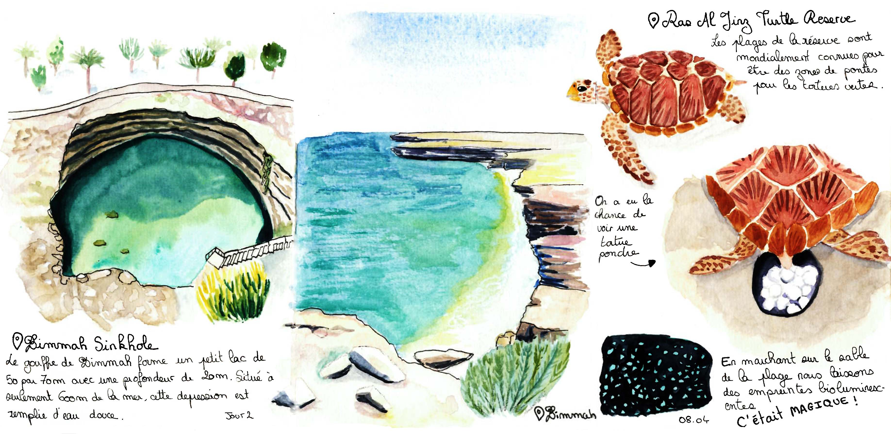

  
<h1 style="color:#C2274B; font-family: Georgia;font-size: 150%">Avril 2024 ~ Une semaine au Sultanat d'Oman</h1>

Souvenirs d'une semaine de road trip à Oman. Découvrez la beauté de ce pays à travers mon carnet de voyage qui immortalisent ses paysages désertiques et les wadis verdoyants.

 
 

  

    

      

        

      
A la découverte de Muscate la capitale d'Oman

    

    

      

        

      
La Grande Mosquée à Muscate 

    

    

      

        

      
Direction le sud-est à la fameuse réserve de nidification des tortues vertes

    

  

<h1 style="color:#C2274B; font-family: Georgia;font-size: 150%">La suite arrive bientôt !</h1>

