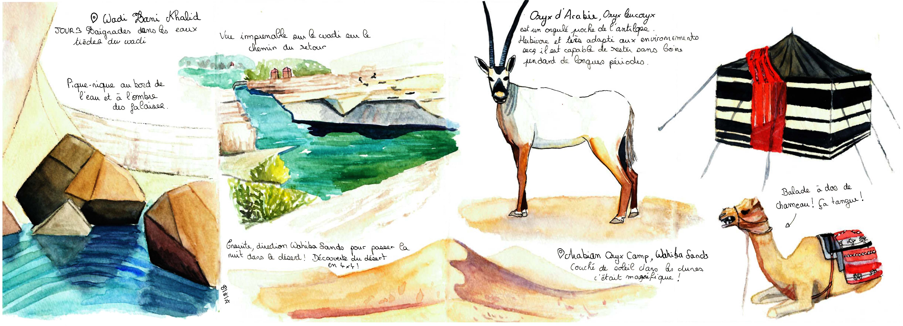
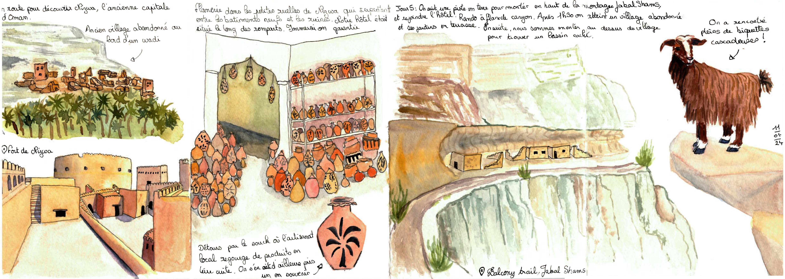

  
<h1 style="color:#C2274B; font-family: Georgia;font-size: 150%">Avril 2024 ~ Une semaine au Sultanat d'Oman</h1>

Souvenirs d'une semaine de road trip à Oman. Découvrez la beauté de ce pays à travers mon carnet de voyage qui immortalisent ses paysages désertiques et les wadis verdoyants.

 
 

  

    

      

        

      
A la découverte de Muscate la capitale d'Oman

    

    

      

        

      
La Grande Mosquée à Muscate 

    

    

      

        

      
Direction le sud-est et la fameuse réserve de nidification des tortues vertes

    

        

      

        

      
Baignade au Wadi Bani Khalid et découverte du désert Wahida Sands

    

        

      

        

      
On fini avec les hauteurs avec la ville de Nizwa et la montagne Jabal Shams

    

  

<h1 style="color:#C2274B; font-family: Georgia;font-size: 150%"></h1>

