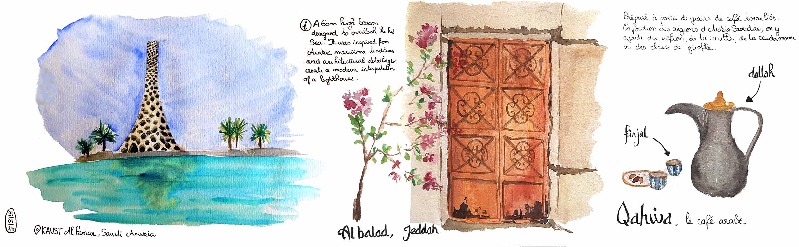
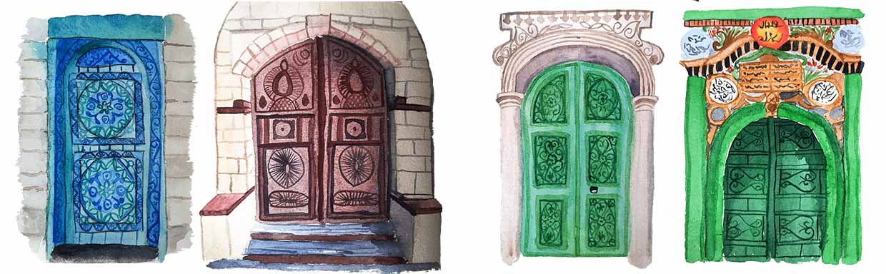
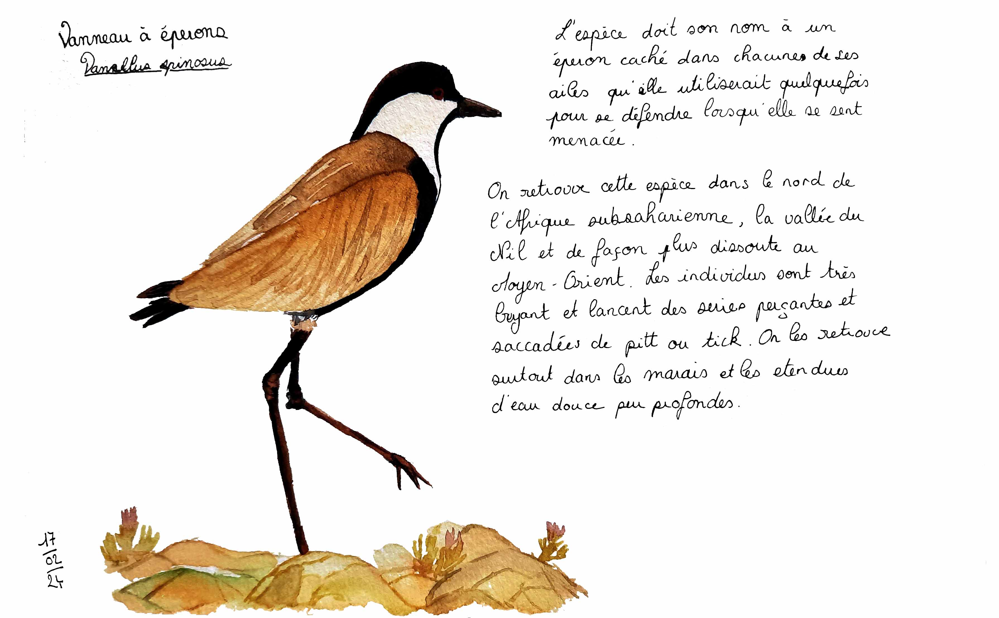
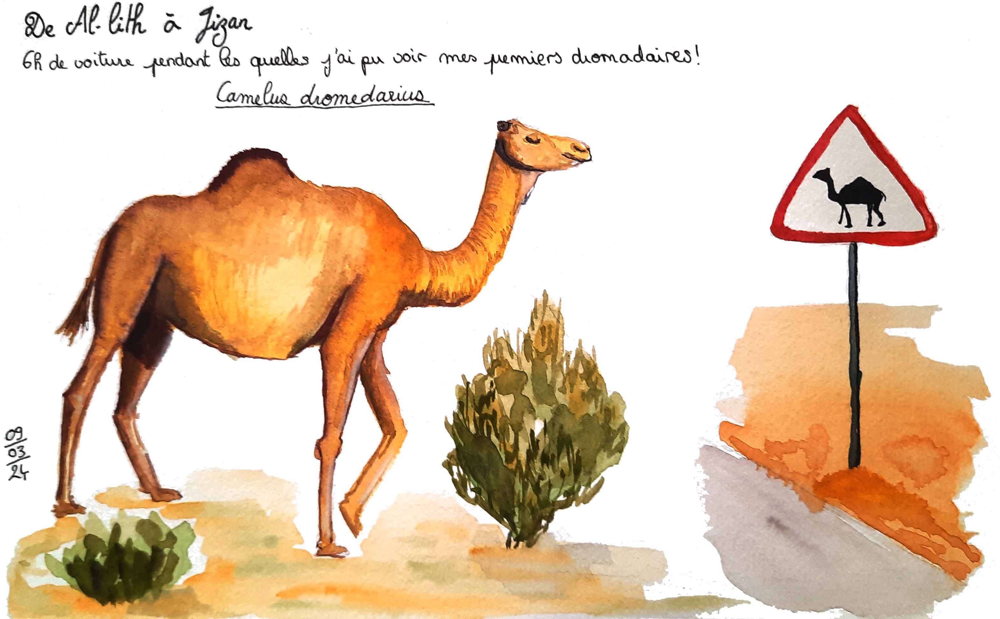
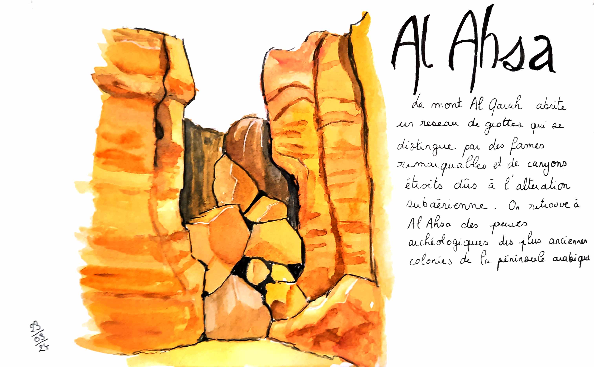
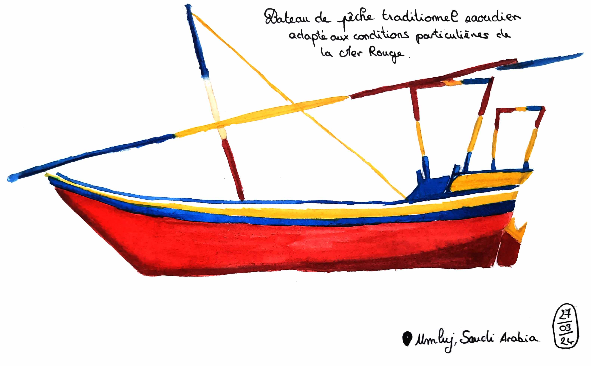
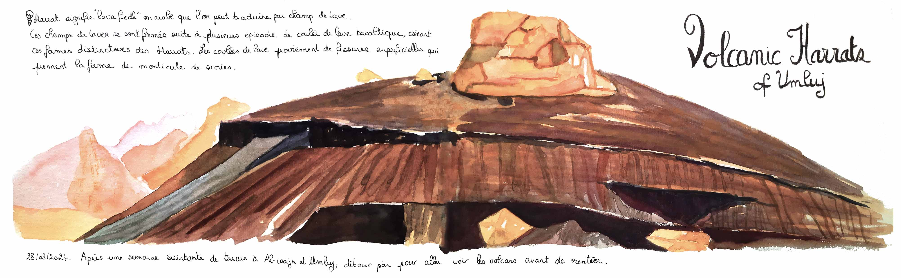

  
Depuis septembre 2023, je vis en Arabie Saoudite au bord de la Mer Rouge. Je vous invite à découvrir avec moi la beauté de ce pays encore peu connu. Ces aquarelles immortalisent mon temps passé dans ces paysages désertiques et les couleurs vibrantes de la culture saoudienne.

 
 

  

    

      

        

      
Vue de la piscine

    

    

      

        

      
Phare de KAUST et pause café à Al-Balad 

    

    

      

        

      
Portes historiques de la vielle ville de Jeddah, Al-Balad 

    

    

      

        

      
Vanneau à éperons

    

    

      

        

      
Dromadaire croisé sur la route pour se rendre à Jizan

    

     

      

        

      
Grottes de Al Ahsa à l'est du pays

    

    

      

        

      
Bateau de pêche traditionnel saoudien

    

    

      

        

      
Champs de laves près de Umluj

    

  

