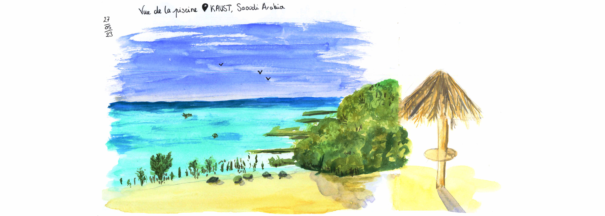
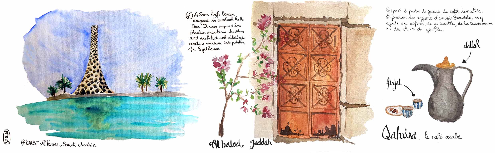
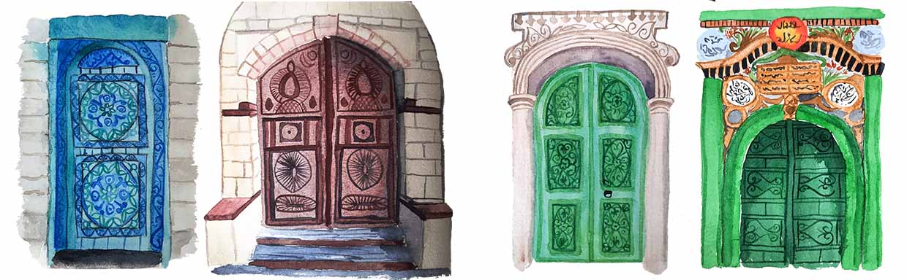
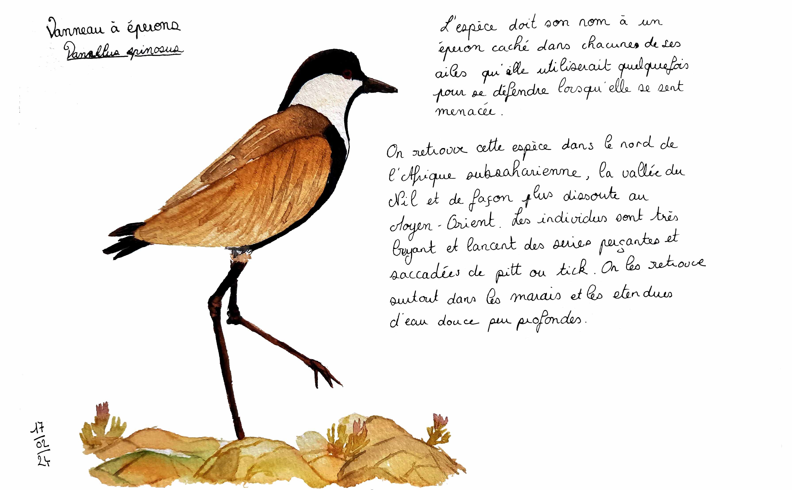

  
Depuis septembre 2023, je vis en Arabie Saoudite au bord de la mer rouge 

 
 

  

    

      

        

      
Vue de la piscine

    

    

      

        

      
Phare de KAUST et pause café à Al-Balad 

    

    

      

        

      
Portes historiques de la vielle ville de Jeddah, Al-Balad 

    

    

      

        

      
Vanneau à éperons

    

  

