

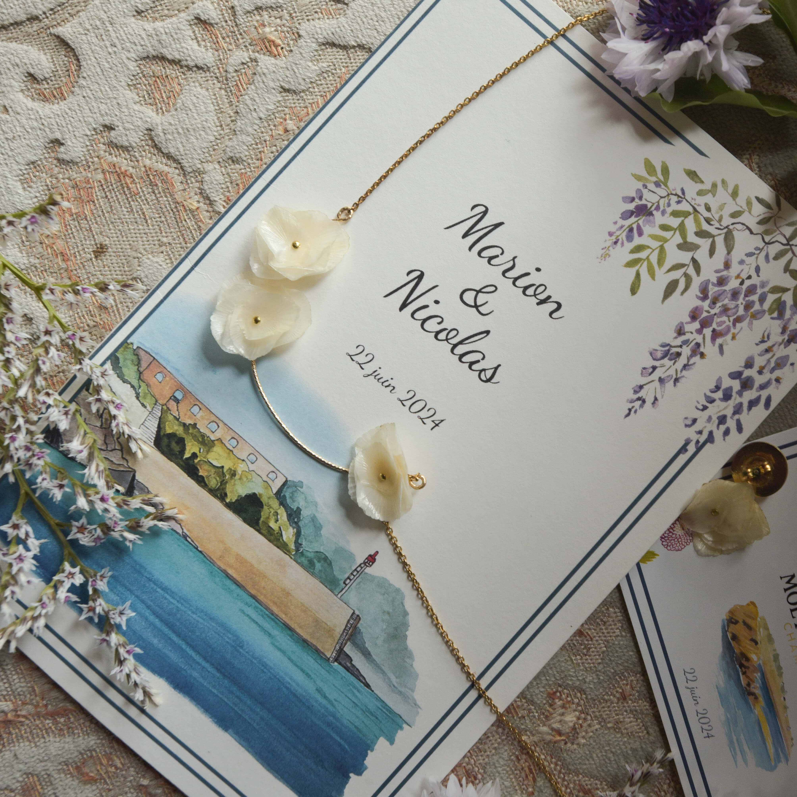 
 
 
Nous avons annoncé notre plus beau "oui" à notre entourage avec un faire-part de mariage que j'ai illustré pour l'occasion. Inspirée par le lieu de cérémonie et par les fleurs bretonnes de saison, j'ai peins l'ensemble des illustrations à l'aquarelle afin de créer une collection unique et à notre image pour annoncer un mariage coloré de début d'été !

 
 

    

      

       <ul style="text-align: start">

La collection comporte : 
       
<li>Des faire-parts champêtre au format portrait plié</li>
<li>Des auto-collant pour enjoliver les enveloppes</li>
<li>Des goblets éco-responsables à offrir aux invités</li>
<li>Des étiquettes pour la cuvé des mariés</li>
<li>Un menu au format A2 pour affiché en grand les délices du jour</li>
<li>Des menus pour les tables</li>
<li>Un plan de tables au format A2</li>
<li>Un set de noms de tables</li>
<li>Des carte de remerciement</li>
        </ul>
        

      

   

  

   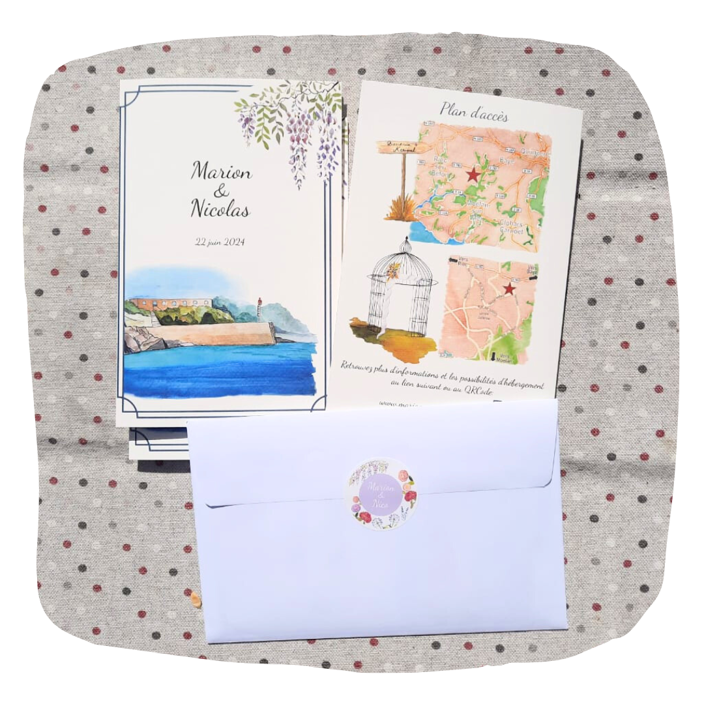
  

 
 

            

                
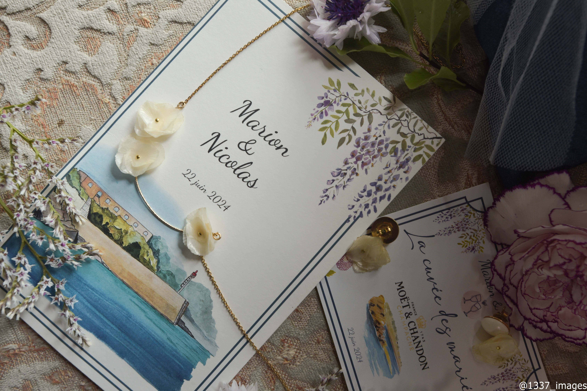

                
Faire-part de mariage

            

            

                
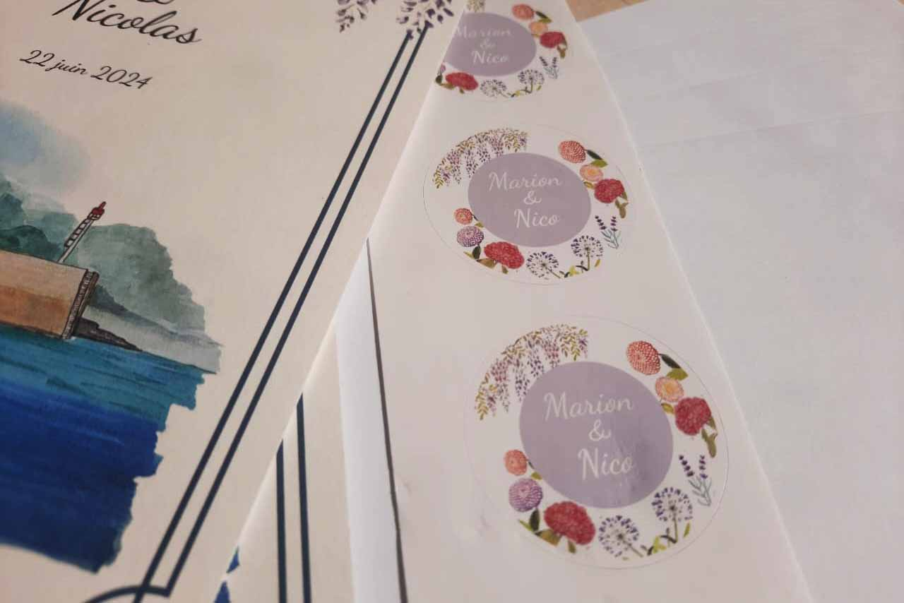

                
Autocollant pour les enveloppes

            

            

                
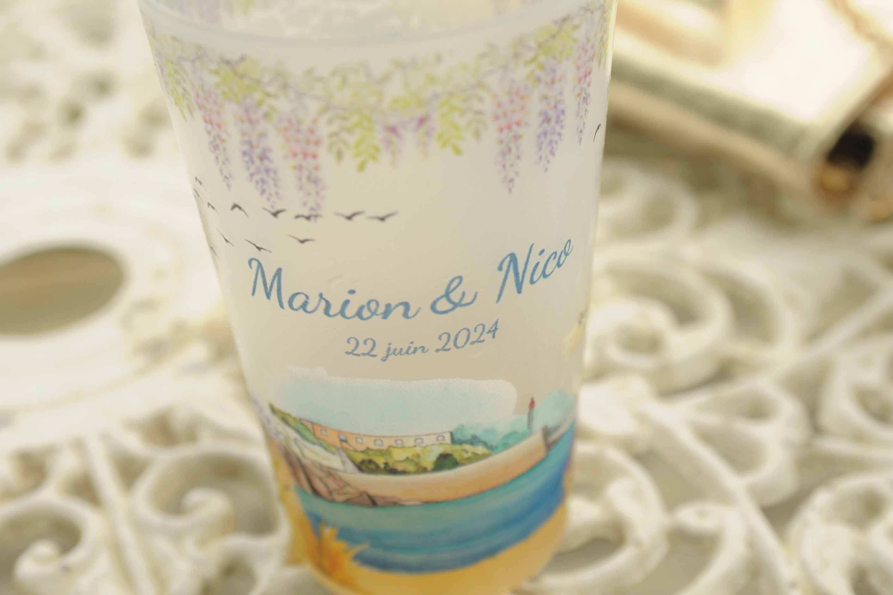

                
Goblets éco-responsables

            

            

                
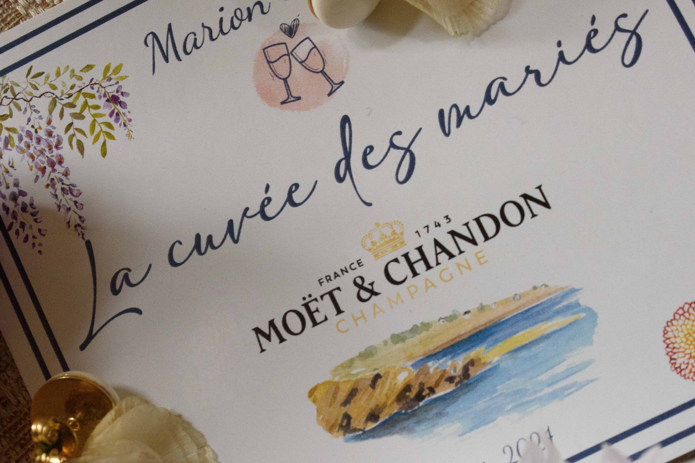

                
Etiquettes pour les bouteilles

            

            

                
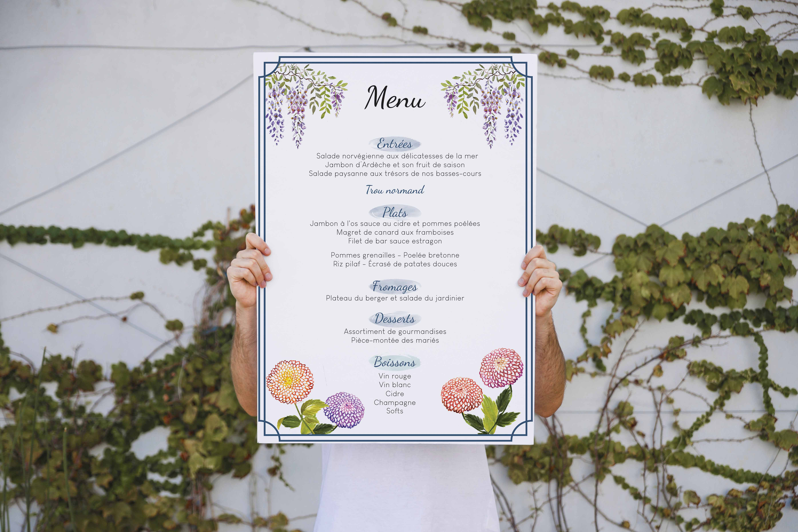

                
Affiche du menu

            

            

                
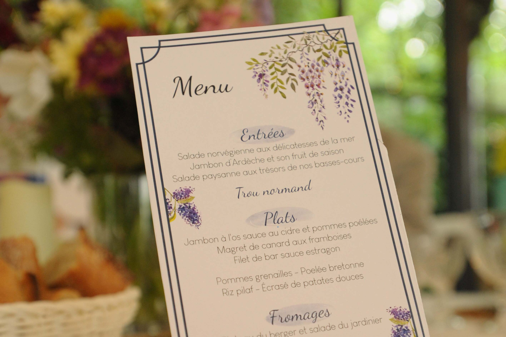

                
Menu pour les tables

            

            

                
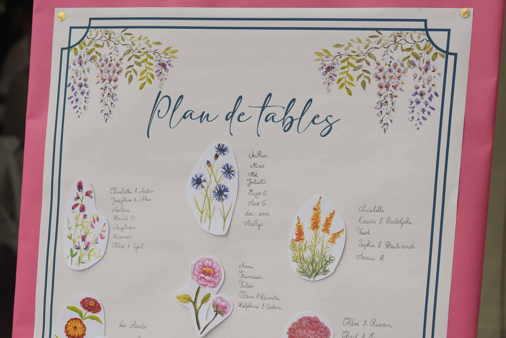

                
Plan de tables au format A2

            

            

                
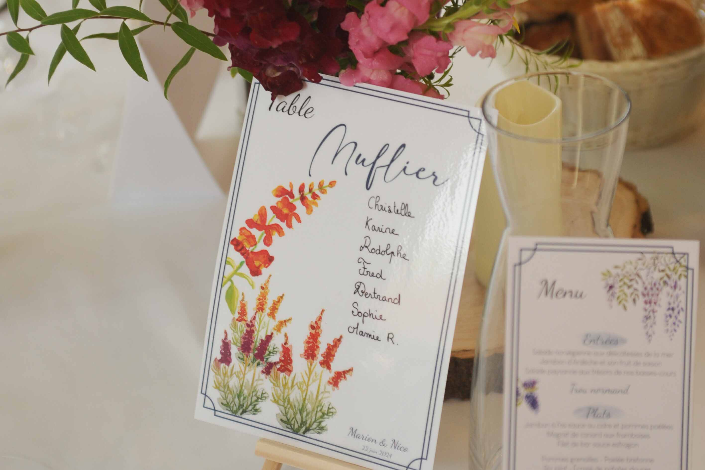

                
Nom de table champêtre

            

            

                
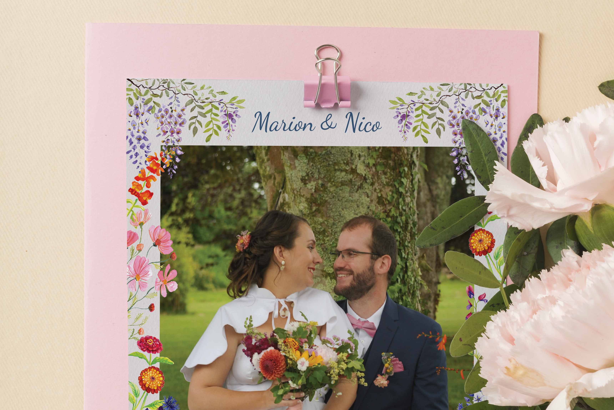

                
Carte de remerciement

            

        

 
 
 
 

N'hésitez pas à me contacter pour une réalisation personnalisée ! Je serais très heureuse de vous accompagner pour partager vos moments de bonheur.

