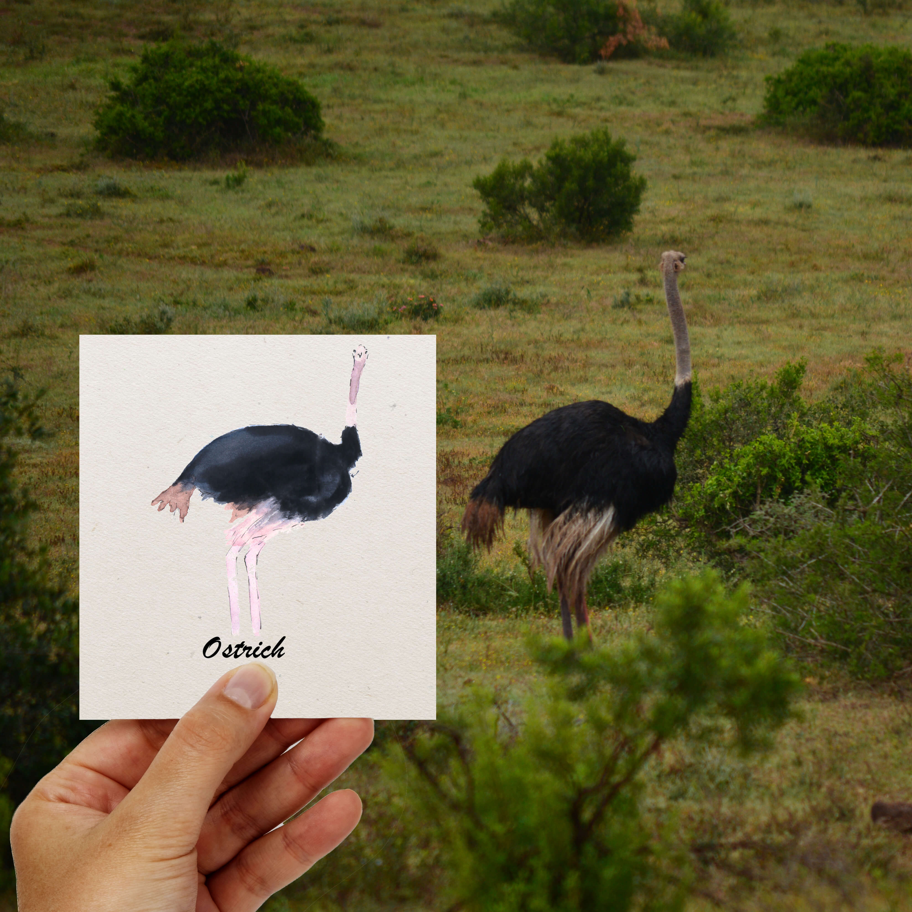

 
 
L'autruche est plus grand oiseau actuel, mais qui est malheureusement menacé de disparition. L’autruche est le plus rapide des oiseaux terrestres. Elle peut courir à la vitesse de 40 km/h pendant une demi-heure et avec des pointes à 90 km/h sur de très courtes distances, elle est plus rapide que la lionne ! L’autruche peut sauter 1,50 mètre en hauteur et 4 mètres en longueur

