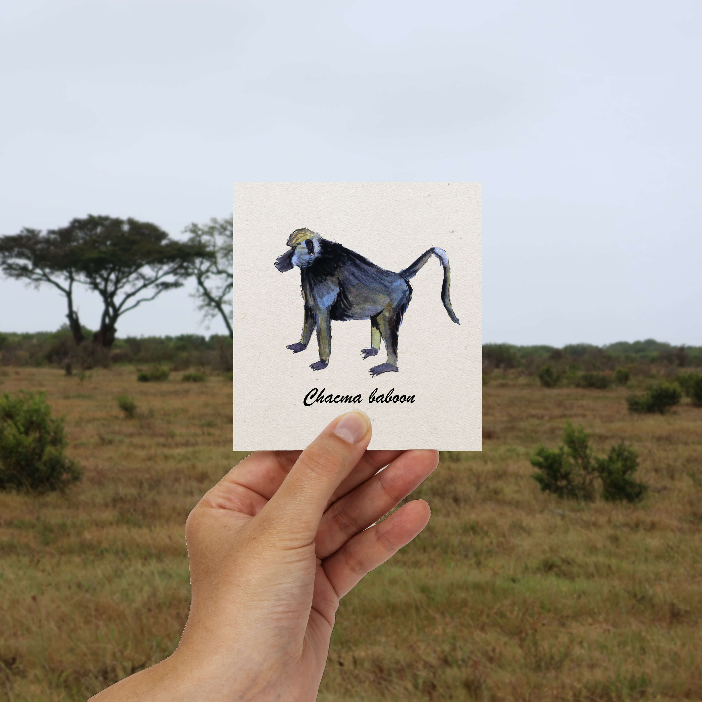

<h1 style="font-size: 120%">Illustration à l'aquarelle d'un babouin observé lors d'un safari en Afrique du Sud.</h1>
 
 
 
**Papio ursinus ursinus**, est une espèce de gros babouins de savane. Il s'agit de la plus grande et la plus grosse espèce du
genre **Papio**. Ils n'attaquent pas spontanément les
humains mais ils n'hésitent pas à utiliser leurs canines,
plus longues que celles des lions, pour saisir de la
nourriture, défendre leur progéniture ou s'ils se sentent
pris au piège. On n'a pas fait les fières en rando quand
on a vu des traces de pas sur les sables et encore
moins quand on les a entendu crier😅

