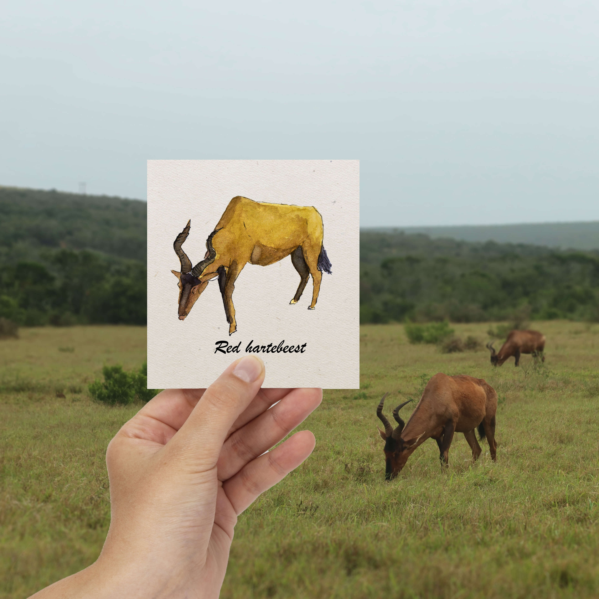

<h1 style="font-size: 120%">Illustration à l'aquarelle d'un bubale rouge observé lors d'un safari en Afrique du Sud.
</h1>
 
 
 
Le bubale rouge, **Alcelaphus buselaphus caama**, également appelé bubale du Cap ou Caama, est une grande antilope africaine. C'est le bubale le plus coloré, avec des marques noires contrastant avec son abdomen et son derrière blancs. Il a une face plus longue que les autres sous-espèces, avec des cornes complexes et incurvées jointes à la base.

