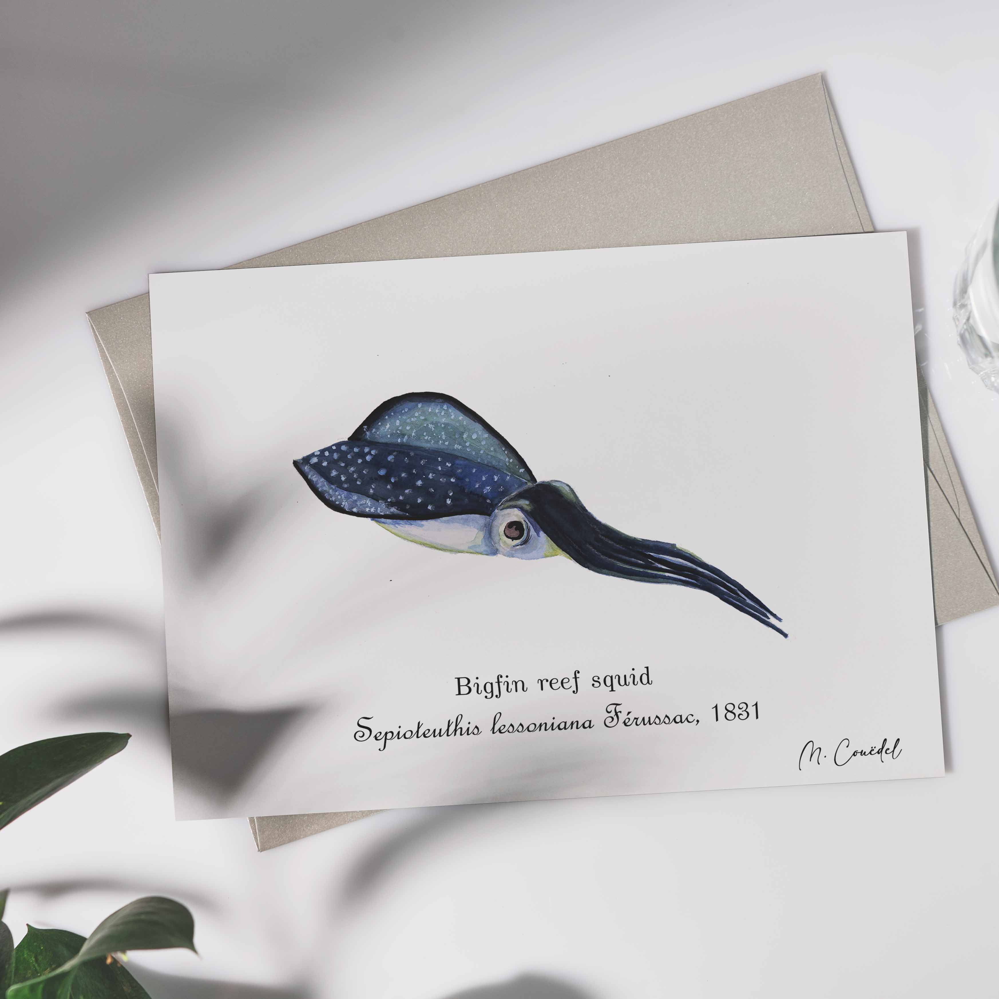

 
 
 
Le calamar de récif à grandes nageoires<i>Sepioteuthis lessoniana</i> peut être observé dans le lagon de l'île de La Réunion. Son corps est translucide, mais parcouru de reflets métalliques verts ou bleutés, et moucheté de points scintillants pouvant émettre de la lumière par bioluminescence (ces organes spéciaux contiennent des bactéries bioluminescentes). Ces calamars sont pourvus de dix tentacules, mais seuls huit sont visibles en temps normal, les deux tentacules de chasse étant dissimulés

