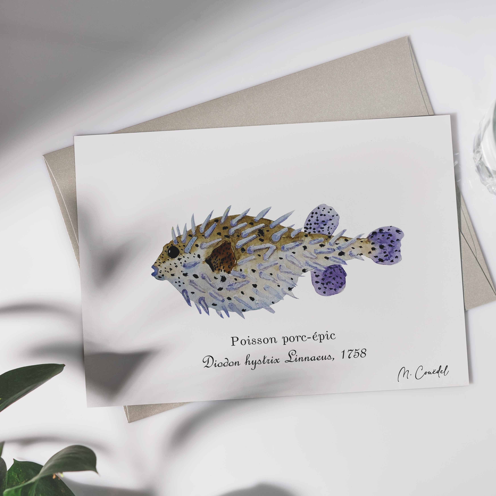

<h1 style="font-size: 120%">Illustration naturaliste à l'aquarelle de Poisson porc-épic, un habitant typique de récifs coralliens, lagon et zones rocheuses</h1>
 
  
<h1 class="h1-naturalist">Poisson porc-épic ~ <i>Diodon hystrix</i></h1>

<h2 class="h2-naturalist">Classification</h2>
<b>Famille :</b> Diodontidae   
<b>Nom scientifique :</b> <i>Diodon hystrix</i>   
<b>Nom commun :</b> Poisson porc-épic

<h2 class="h2-naturalist">Répartition et habitat</h2>
Présent dans l’Indo-Pacifique, ce poisson se cache souvent dans les crevasses des récifs et les zones rocheuses peu profondes.

<h2 class="h2-naturalist">Description</h2>
Egalement connu sous le nom de Diodon hérissé, il possède un corps globuleux, capable de se gonfler en boule et hérissé de piquants. Sa tête large et ses yeux vifs lui donnent un air curieux et malicieux

<h2 class="h2-naturalist">Régime alimentaire</h2>
Se nourrit principalement de mollusques, crustacés et échinodermes, qu’il casse grâce à ses dents robustes

<h2 class="h2-naturalist">Comportement</h2>
Espèce solitaire ou en petits groupes, diurne, se gonfle pour intimider ses prédateurs et peut rester très immobile pour passer inaperçu

<h2 class="h2-naturalist">Rôle écologique</h2>
Régule les populations d’invertébrés benthiques et contribue à l’équilibre du récif

