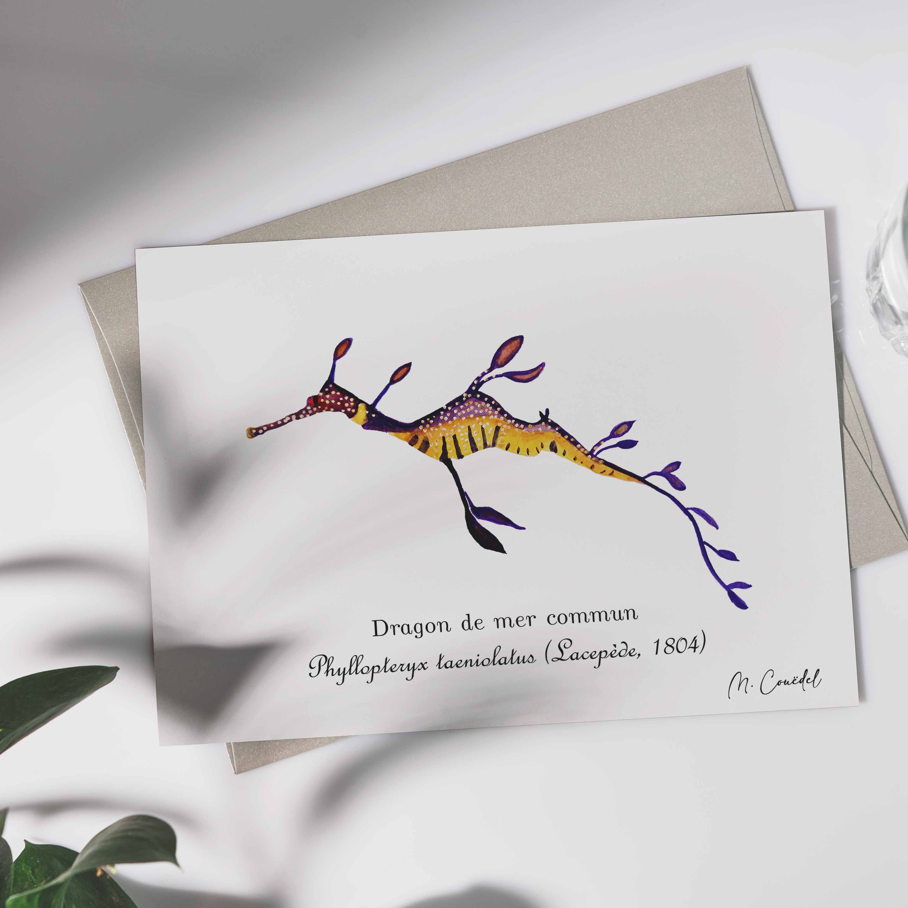

<h1 style="font-size: 120%">Illustration naturaliste à l'aquarelle de Dragon des mers feuillu, hypocampe au camouflage exceptionnel ressemblant à des algues.</h1>
 
  
<h1 class="h1-naturalist">Dragon des mers feuillu ~ <i>Phyllopteryx taeniolatus</i></h1>

<h2 class="h2-naturalist">Classification</h2>
<b>Famille :</b> Syngnathidae   
<b>Nom scientifique :</b> <i>Phyllopteryx taeniolatus</i>   
<b>Nom commun :</b> Dragon des mers feuillu

<h2 class="h2-naturalist">Répartition et habitat</h2>
Le dragon des mers feuillu vit dans les eaux tempérées du sud de l’Australie, principalement dans les herbiers marins, les récifs rocheux et les zones riches en algues.

<h2 class="h2-naturalist">Description</h2>
Ce poisson fascinant possède des appendices en forme de feuilles qui lui permettent de se camoufler parfaitement dans les algues. Son corps allongé et ses mouvements lents renforcent cette illusion.

<h2 class="h2-naturalist">Régime alimentaire</h2>
Il se nourrit principalement de petits crustacés comme les mysidacés et le zooplancton qu’il aspire grâce à son museau tubulaire.

<h2 class="h2-naturalist">Comportement</h2>
Espèce discrète et solitaire, elle se déplace lentement et dépend fortement de son camouflage pour éviter les prédateurs.

<h2 class="h2-naturalist">Rôle écologique</h2>
Le dragon des mers joue un rôle dans le maintien de l’équilibre des petits invertébrés dans les herbiers marins. Il est sensible à la pollution et à la destruction de son habitat.

