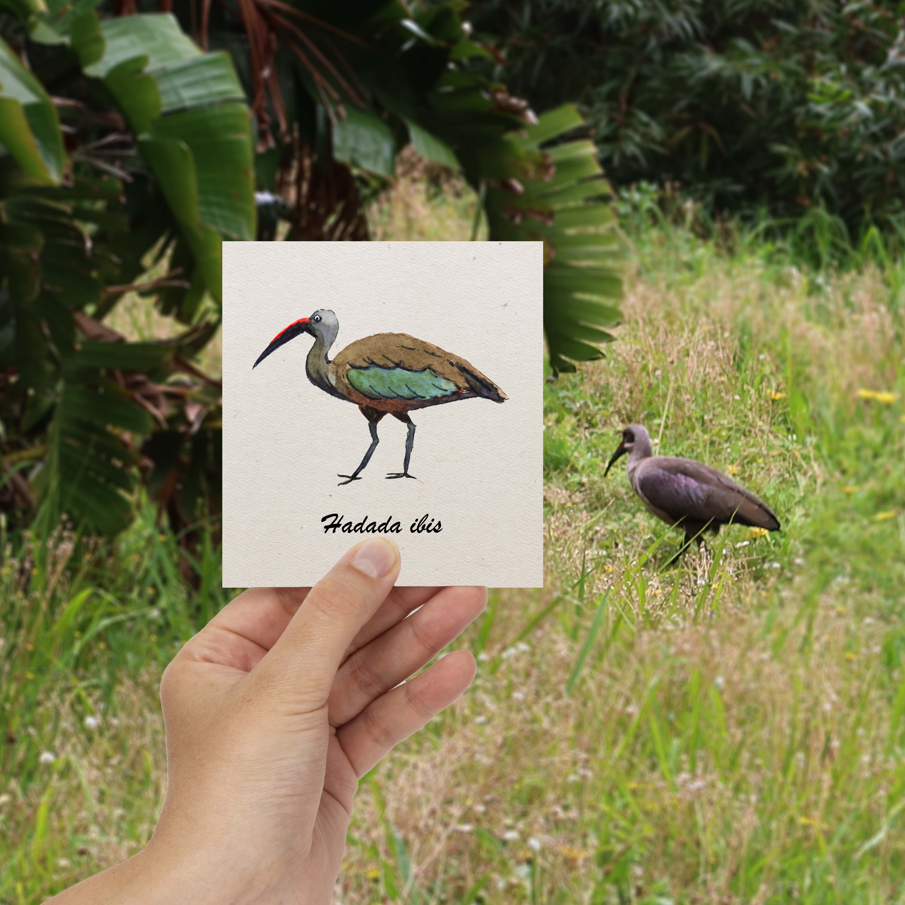

<h1 style="font-size: 120%">Illustration à l'aquarelle d'un ibis en Afrique du Sud.</h1>
 
 
 
L'ibis hadada porte son nom dû à son cri composé des 3 syllabes "ha-da-da". c'est un peu le piegon d'afrique du Sud.

