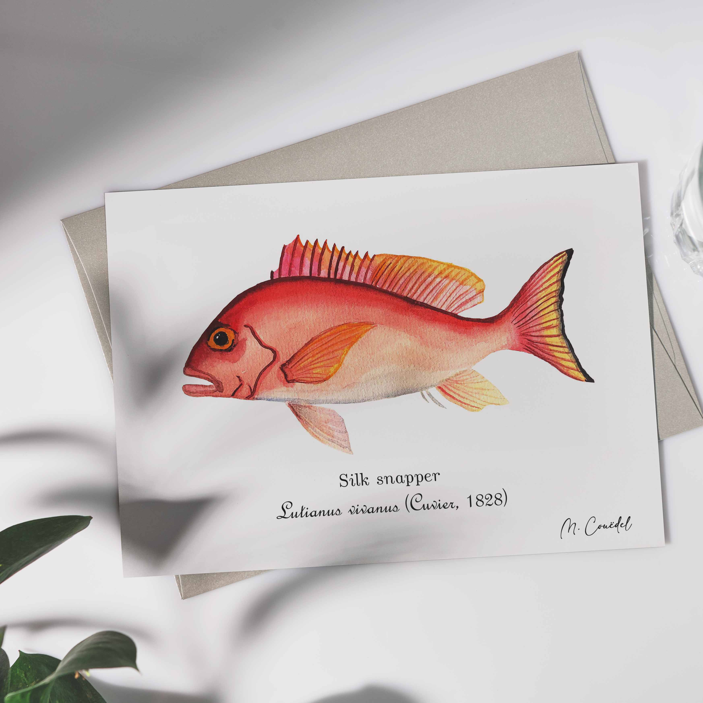

<h1 style="font-size: 120%">Illustration naturaliste à l'aquarelle du vivaneau soie</h1>
 
 
 
Le vivaneau soie<i>Lutjanus vivanus</i> est péché dans les eaux réunionnaises et est très apprécié en cuisine

