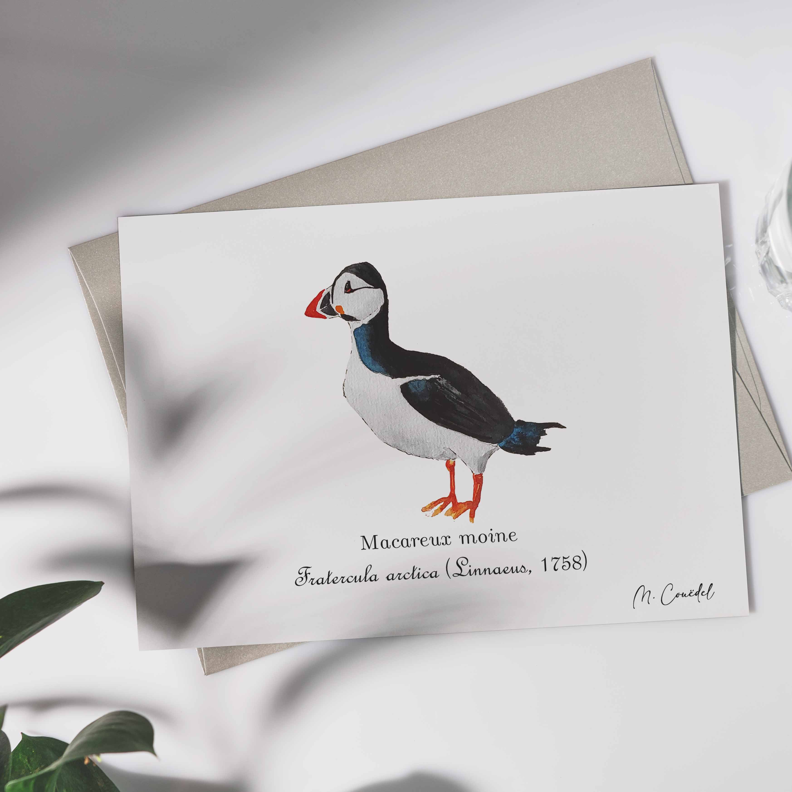

 
 
 
Le Macareux moine (<i>Fratercula arctica</i>), aussi appelé perroquet de mer ou calculot , est une espèce d'oiseaux marins pélagiques nord-atlantique qui vit en haute mer, sauf lors de sa reproduction qui le contraint à rejoindre la terre ferme où il niche sur les pentes enherbées, les îles ou sur des falaises (insulaires ou continentales).

