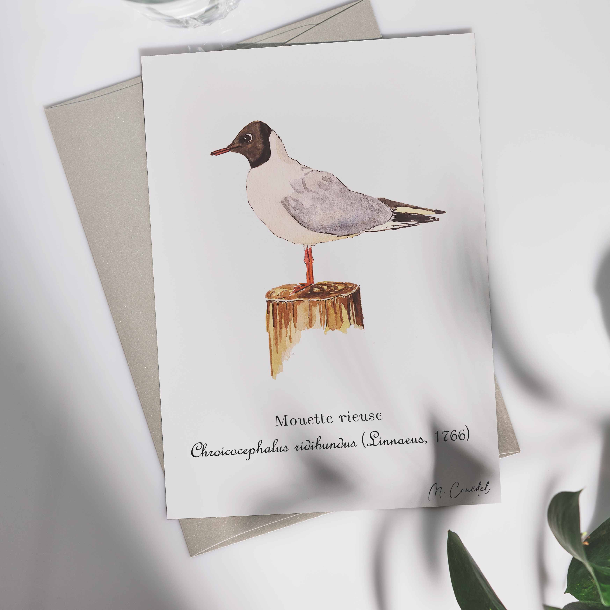

<h1 style="font-size: 120%">Illustration naturaliste à l'aquarelle d'une mouette rieuse en Bretagne</h1>

 
 
 
La mouette rieuse (<i>Chroicocephalus ridibundus</i>, anciennement <i>Larus ridibundus</i>), est de couleur blanche avec les ailes gris perle sauf l'extrémité noire. La tête est brun sombre sauf en hiver où elle est blanche avec une tache noirâtre derrière l'œil. Les pattes sont orange ou rouge-orangé. Le bec est orangé à rouge sombre.

