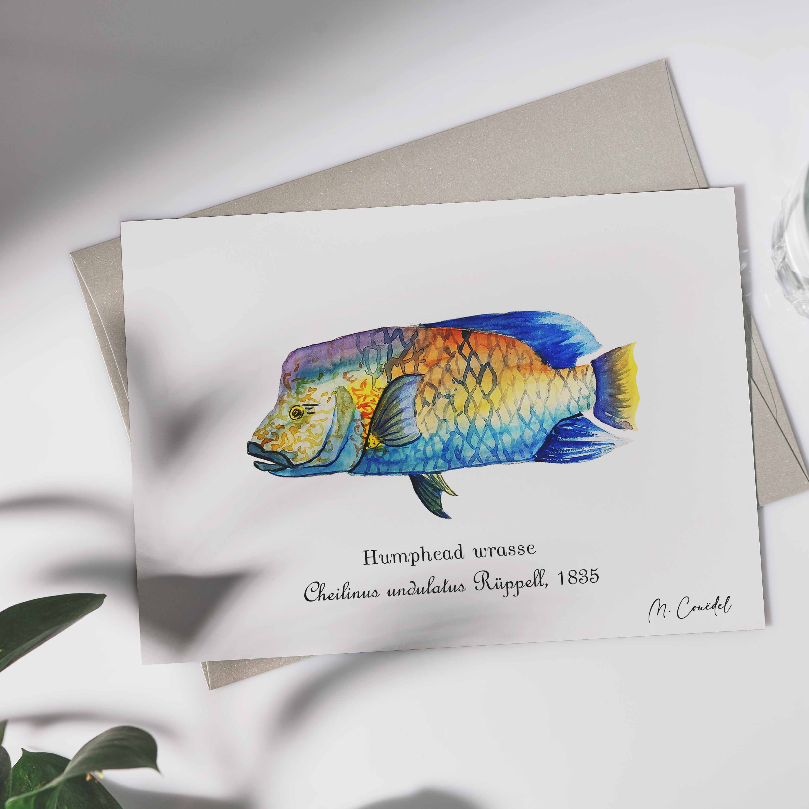

 
 
 
Le Napoléon au apellé le labre géant, <i>Cheilinus undulatus</i>, est le plus grand des poissons osseux des récifs coralliens. Ils dorment souvent dans les anfractuosités du récifs qu'ils fréquentent ou dans les épaves. On les retrouve dans les eaux tropicales de la Mer Rouge, de l'Océan Indien jusqu'aux îles du centre de l'Océan Pacifique.

