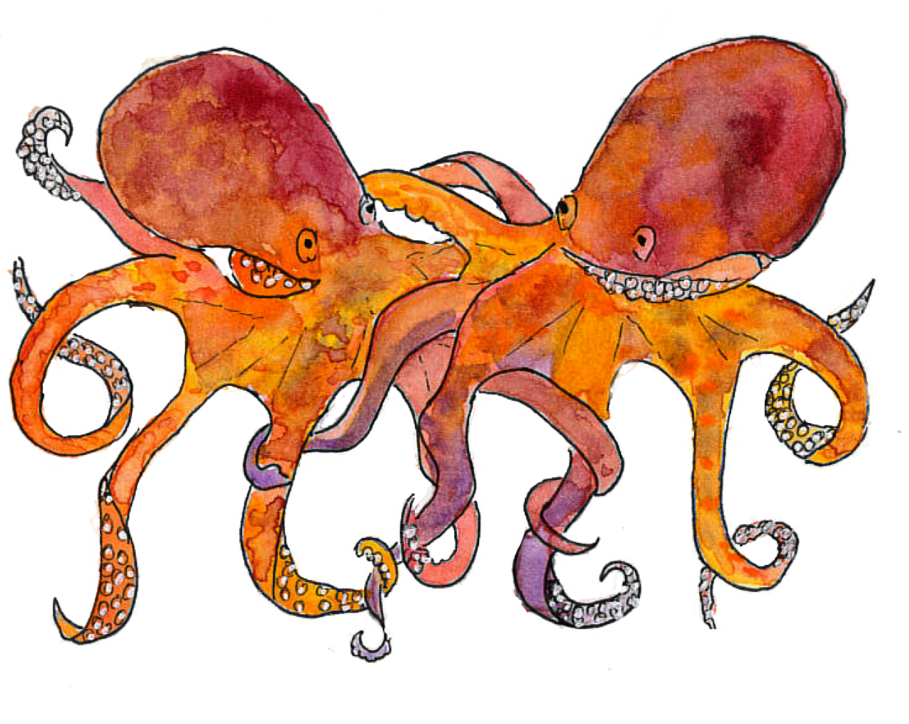

<h1 style="font-size: 120%">Illustration naturaliste à l'aquarelle de Poulpe commun, un habitant typique de Fonds rocheux côtiers et zones sablo-vaseuses de Bretagne</h1>
 
  
<h1 class="h1-naturalist">Poulpe commun ~ <i>Octopus vulgaris</i></h1>

<h2 class="h2-naturalist">Classification</h2>
<b>Famille :</b> Octopodidae   
<b>Nom scientifique :</b> <i>Octopus vulgaris</i>   
<b>Nom commun :</b> Poulpe commun

<h2 class="h2-naturalist">Répartition et habitat</h2>
Le poulpe commun, a une répartition mondiale dans les eaux tempérées, subtropicales et tropicales. Ces deernières années il est particulièrement abondant sur les côtes bretonnes et on peut les apercevoir dans les marres d'eau laissées dans les rochers à marée basse.
.

<h2 class="h2-naturalist">Description</h2>
Ce céphalopode au corps souple et aux bras puissants est capable de changer de couleur et de texture pour se camoufler. Ses yeux vifs et son intelligence le rendent fascinant à observer

<h2 class="h2-naturalist">Régime alimentaire</h2>
Se nourrit de crabes, mollusques et petits poissons, capturés grâce à ses bras et son bec robuste

<h2 class="h2-naturalist">Comportement</h2>
Espèce solitaire et nocturne, extrêmement intelligente : capable d’ouvrir des coquilles, de se faufiler dans des espaces étroits, de créer des cachettes et de manipuler son environnement

<h2 class="h2-naturalist">Rôle écologique</h2>
Prédateur clé des invertébrés benthiques, régulant les populations de crabes et mollusques le long des côtes. Toutefois en forte abondance, il peut faire des ravages et fortement impacter l'économie lié à la pêche des crustacés et coquillages.

