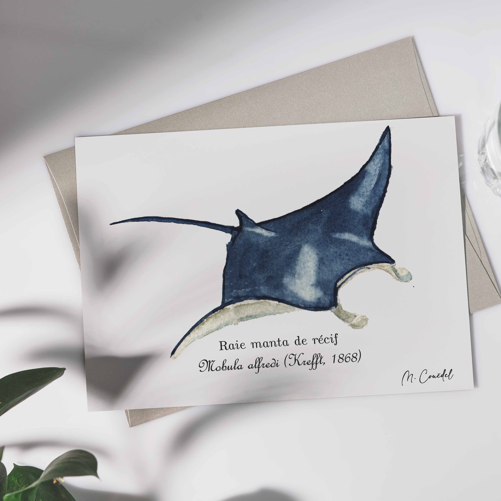

<h1 style="font-size: 120%">Illustration naturaliste à l'aquarelle d'une raie manta de récifs, une habitante typique de récifs coralliens et lagons</h1>
 
  
<h1 class="h1-naturalist">Raie manta de récifs ~ <i>Mobula alfredi</i></h1>

<h2 class="h2-naturalist">Classification</h2>
<b>Famille :</b> Mobulidae   
<b>Nom scientifique :</b> <i>Mobula alfredi</i>   
<b>Nom commun :</b> Raie manta de récifs

<h2 class="h2-naturalist">Répartition et habitat</h2>
On croise cette majestueuse raie dans les eaux turquoise de l’Indo-Pacifique, glissant avec grâce près des lagons et des pentes de récifs, souvent autour des stations de nettoyage coralliennes

<h2 class="h2-naturalist">Description</h2>
Impressionnante et élégante, elle déploie ses ailes pouvant atteindre 5 m pour planer avec légèreté. Son dos gris foncé et son ventre blanc ponctué de motifs uniques lui donnent un look inoubliable

<h2 class="h2-naturalist">Régime alimentaire</h2>
Elle se nourrit en filtrant le plancton, petits crustacés et poissons microscopiques, nageant avec une incroyable fluidité la bouche ouverte

<h2 class="h2-naturalist">Comportement</h2>
Diurne et souvent solitaire ou en petits groupes, elle enchante les plongeurs par ses sauts acrobatiques et sa présence élégante autour des stations de nettoyage

<h2 class="h2-naturalist">Rôle écologique</h2>
Véritable gardienne des récifs, elle régule les populations de plancton et contribue à l’équilibre de l’écosystème corallien

