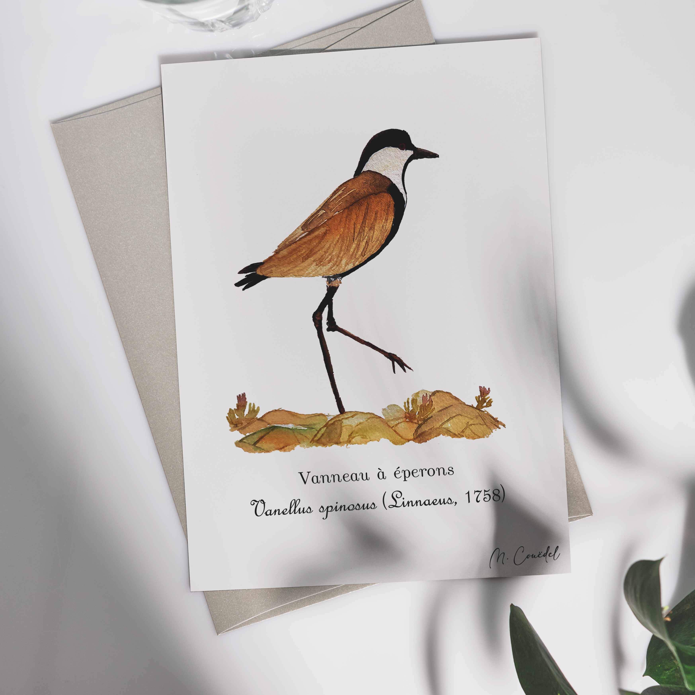

<h1 style="font-size: 120%">Illustration naturaliste à l'aquarelle de Vanneau à éperon, en Arabie saoudite, notamment à KAUST</h1>
 
  
<h1 class="h1-naturalist">Vanneau à éperon ~ <i>Vanellus spinosus</i></h1>

<h2 class="h2-naturalist">Classification</h2>
<b>Famille :</b> Charadriidae   
<b>Nom scientifique :</b> <i>Vanellus spinosus</i>   
<b>Nom commun :</b> Vanneau à éperon

<h2 class="h2-naturalist">Répartition et habitat</h2>
Le vanneau à éperon fréquente les zones humides, les rives de lacs, les marais et les plaines inondables. Il est également très présent en Arabie saoudite, notamment dans la région de KAUST où il s’adapte bien aux milieux aménagés, aux espaces verts et aux zones côtières.

<h2 class="h2-naturalist">Description</h2>
Oiseau de taille moyenne reconnaissable à son plumage contrasté noir, blanc et brun, ainsi qu’à ses éperons visibles sur les ailes. Il possède de longues pattes adaptées à la marche dans les milieux humides.

<h2 class="h2-naturalist">Régime alimentaire</h2>
Il se nourrit principalement d’insectes, de vers, de mollusques et de petits invertébrés qu’il trouve en fouillant le sol.

<h2 class="h2-naturalist">Comportement</h2>
Très territorial, il est connu pour son comportement agressif envers les intrus, notamment pendant la période de reproduction.

<h2 class="h2-naturalist">Rôle écologique</h2>
Il joue un rôle important dans la régulation des populations d’insectes dans les zones humides et les espaces verts urbains.

