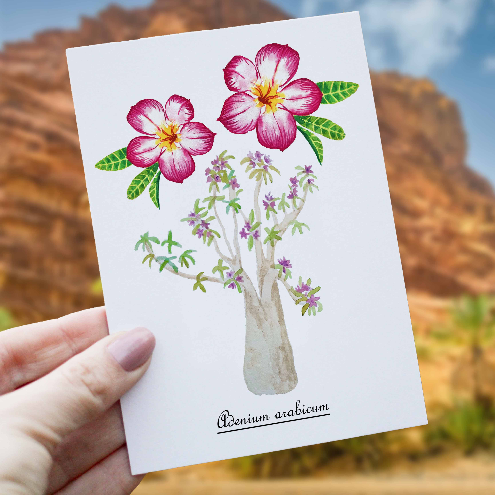

<h1 style="font-size: 120%">
Illustration à l'aquarelle de l'arbre du désert que retrouve communément en Arabie Saoudite</h1>
 
 
 
Ce nom doux et poétique cache en fait une plante résistante et capable de résister à la chaleur et aux sécheresses. La Rose du désert, qui présente un aspect atypique et original, un tronc eayant un gros renflement gris-vert situé à la base du tronc qui sert d'organe de réserve. On trouve les espèces d'<i>Adenium</i> au sud de l'Arabie, au Yémen (île de Socotra), sur les côtes est-africaines, jusqu'au sud de l'Angola et de Namibie, en Afrique subsaharienne, sans qu'il soit possible de déterminer si le genre est natif d'une de ces régions ou s'il a été naturalisé par suite d'importation humaine. 

