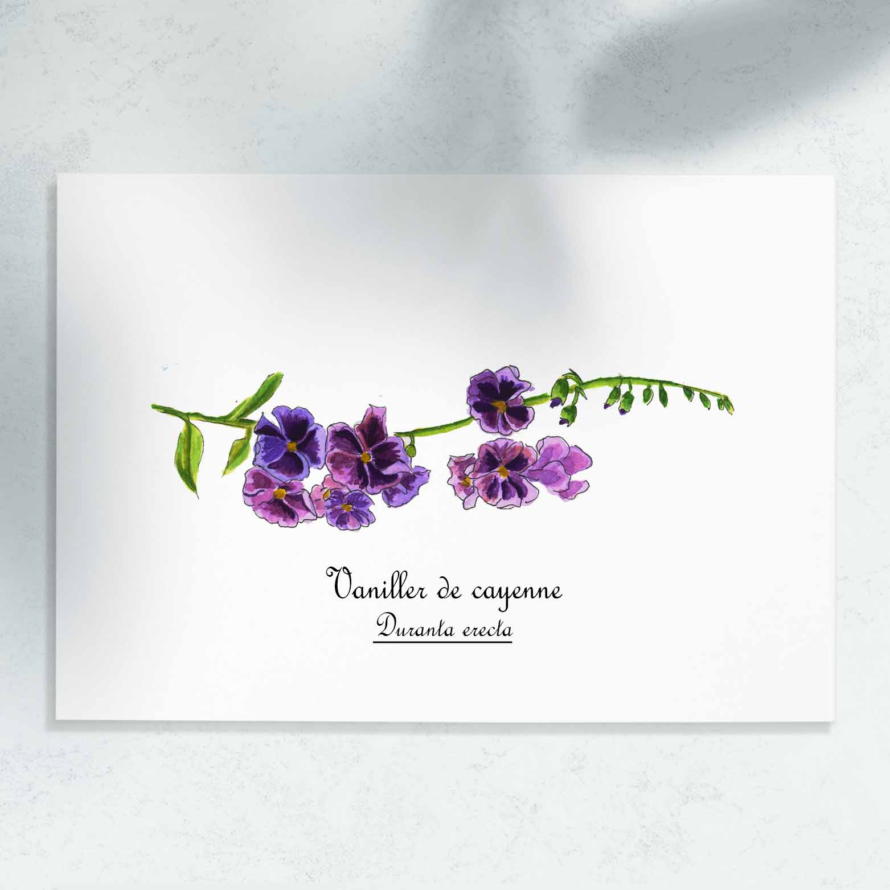

 
 
 
Le vanillier de Cayenne, <i>Duranta erecta</i>, est un arbuste ornemental originaire des régions tropicales d'Amérique centrale. A La Réunion, il peut atteindre 4 à 6 mètres de hauteur, pour une largeur égale. Cette jolie grappe de fleurs violettes a été peinte dans le cirque de Mafate à La Réunion.

