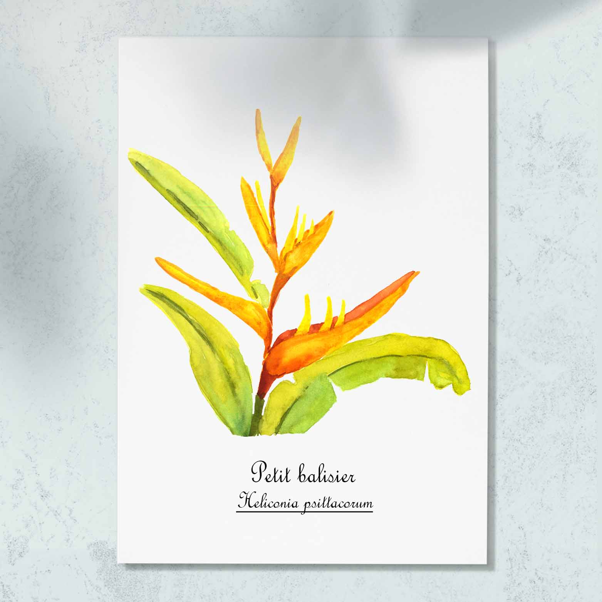

<h1 style="font-size: 120%">
Illustration à l'aquarelle d'une tige d'un petit balisier, fleur emblématique des tropiques</h1>
 
 
 
Le petit balisier, <i>Heliconia psittacorum</i>,est une plante herbacée aux fleurs vivement colorées d'orange à rose. On la retrouve très communément dans les jardins créoles. Celle-ci a été peinte dans le jardin du gîte que nous avions réservé dans le Sud Sauvage de La Réunion.

