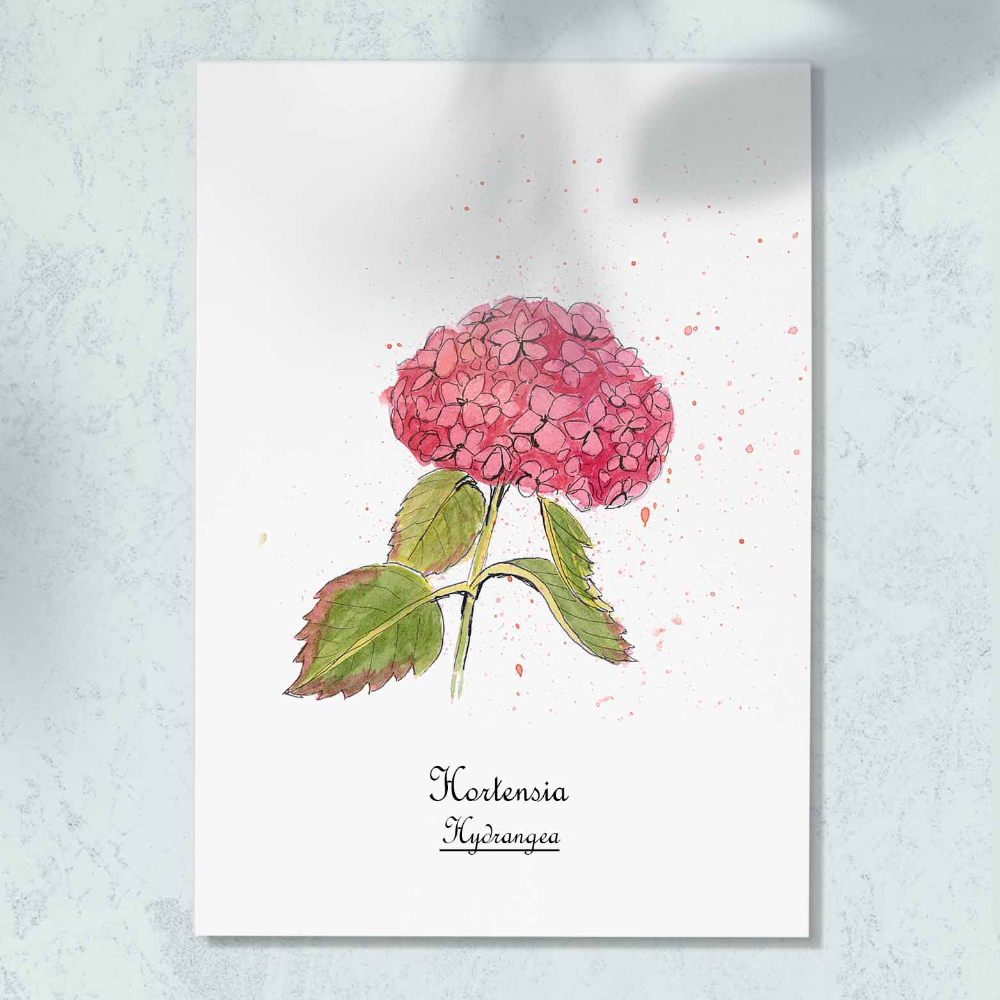

 

 
L'hortensia est un genre (<i> Hydrangea </i>) d'arbustes dont les fleurs forment de généreuses boules aux couleurs flamboyantes emblématiques de la Bretagne et de la Normandie. Du rose allant au bleu, la couleur de ses fleurs liée au pH du sol.

