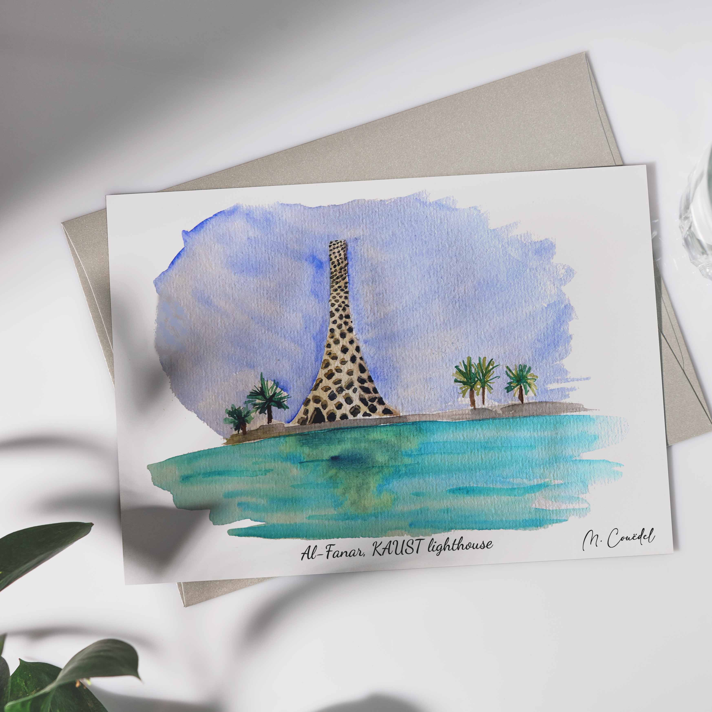
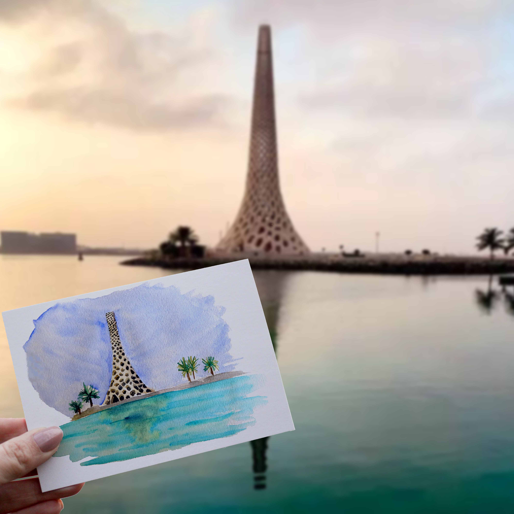

<h1 style="font-size: 120%">
Illustration à l'aquarelle du phare emblématique de KAUST, Arabie Saoudite</h1>
 
 
 
 Le phare emblématique de KAUST qui mesure 60m de haut avec son architecture qui est inspiré de l'art arabe pour créer une interprétation moderne d'un phare. 
 
 

