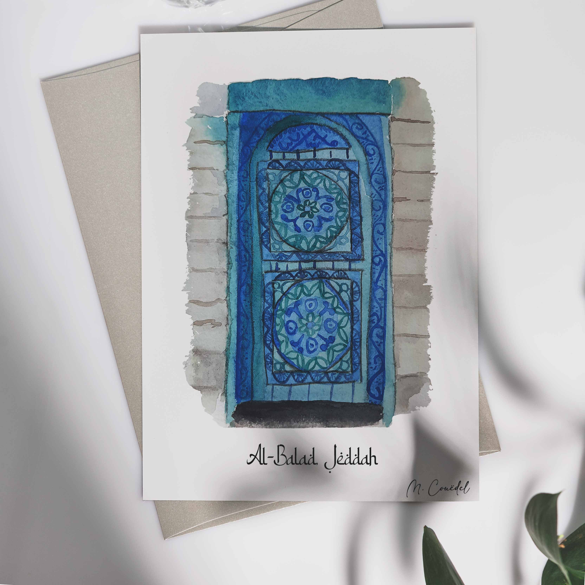

 
 
 
La ville portuaire de Jeddah est la seconde plus grande ville d’Arabie Saoudite. Elle est située le long de la Mer Rouge dans la province de Makkah. Al-Balad, qui se traduit littéralement par “la ville” est le centre historique de Jeddah. Les bâtiments historiques sont caractérisés par de jolies portes en bois sculptés ainsi que par des balcons fermés en bois, similaire aux Mashrabiya en Egypte ou en Irak. 
 
 

