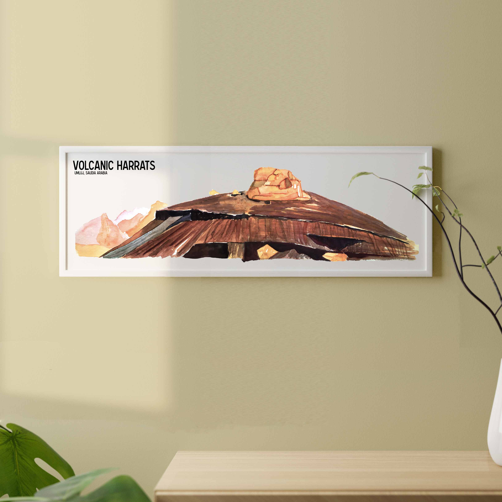
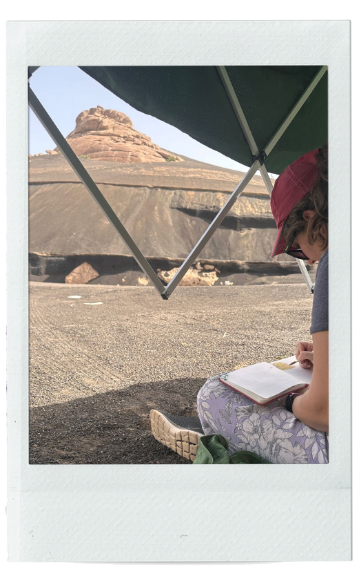

 
 
 
 Ces champs de laves se situent près de la ville de Umluj sur la côte ouest saoudienne. Ils se sont formés suite à plusieurs épisodes de coulée de lave basaltique, créeant ces formes distictives appellées harrats en arabe. Ces coulées de lave proviennent de fissures superficielles qui prennent la forme de monticule de scories. 
 
 

