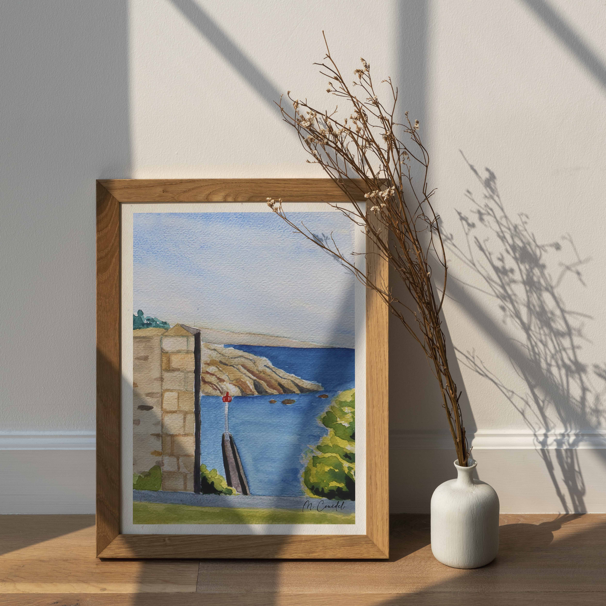
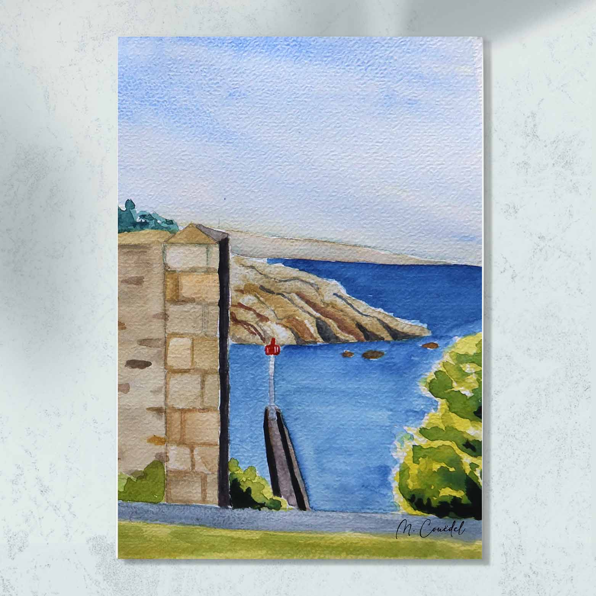

 
 
 
Le port de Brigneau est un port authentique, d’intérêt patrimonial, qui offre de magnifiques variations de couleurs entre le bleu et le vert glaz, couleur typique de l’eau en Bretagne. C’est ici une vraie carte postale du port breton par excellence ! Autrefois, le port de Brigneau était un port de pêche comme en témoigne les murs encore présents de l’ancienne conserverie Malachappe d'où est peint cette aquarelle. 
 
 
Cette aquarelle existe aussi au format carte postale :  
 
 
 

