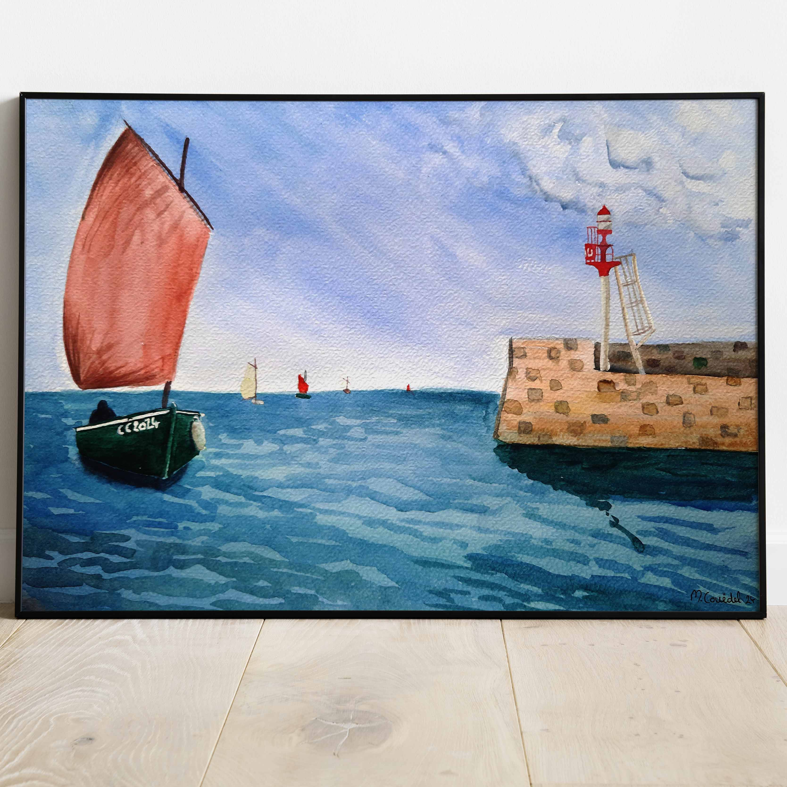

 
 
 
Pendant la première moitié du siècle, le misainier, ou canot breton à misaine, est le plus répandu des petits bateaux de pêche de Bretagne Sud. Les misainiers sont mis à l'honneur chaque année lors de la Fête de la digue au port de Brigneau.
 
 
Cette aquarelle se décline aussi au format carte postale :  
 
 
<a href="/categories/carte/misainier/" title="Carte misainier">
  

                

                
Misainier

            
 
</a>
<a href="/categories/carte/phare-de-brigneau/" title="Carte du phare de Brigneau">
  

                

                
Phare de Brigneau

            
 
</a>

