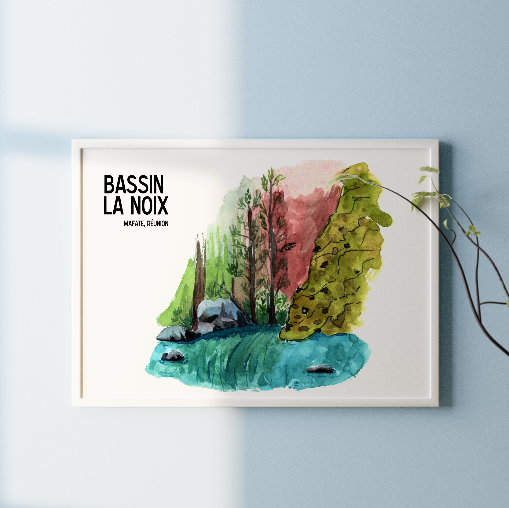

 

Situé entre Aurère et ilet à Malheur au coeur de Mafate, le bassin la noix permet de faire une petite halte rafraichissante après une longue randonnée. Au creux d'un canyon étroit et ombragé, la baignade possible mais attention aux genoux.
 

