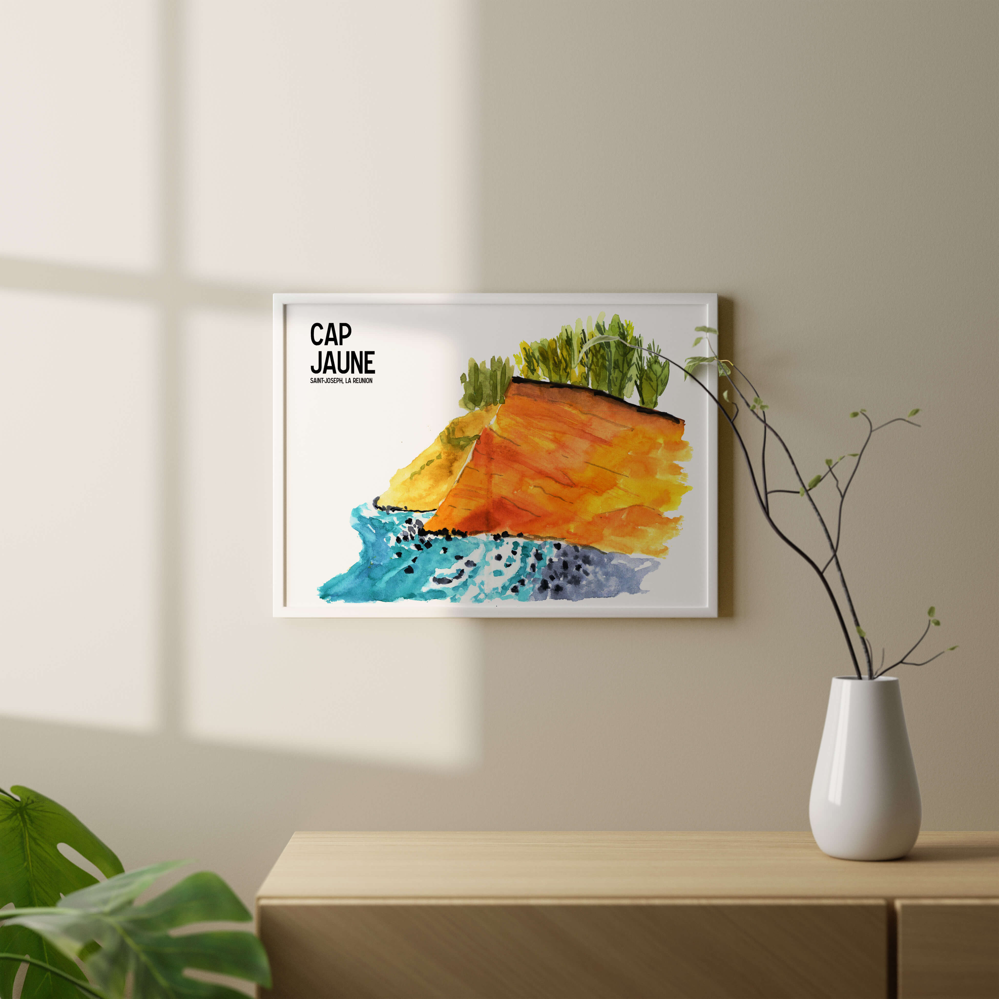

 

Dans le Sud Sauvage à Vincendo, le Cap Jaune est une curiosité géologique d’une hauteur de 50 mètres. Le Cap Jaune est une falaise de couleur ocre formée par des coulées de lave se déversant dans l’eau.
 

