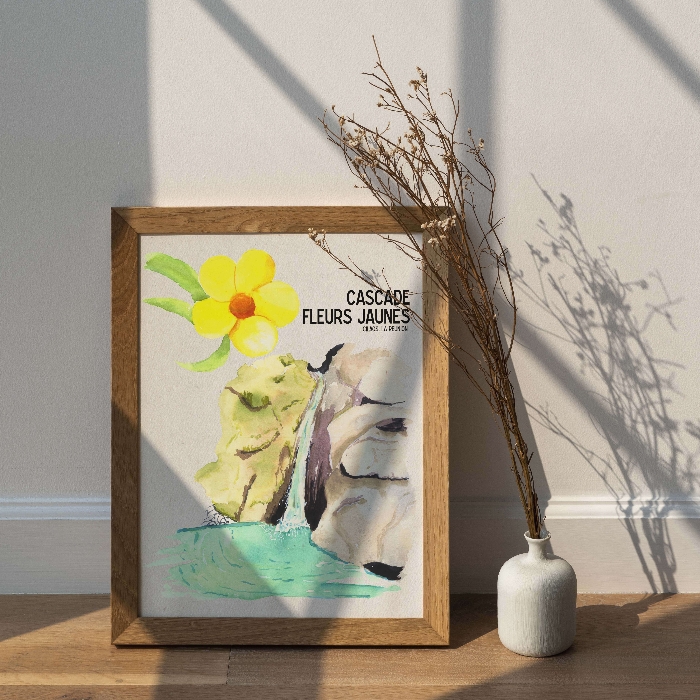

 

A mi-chemin sur la route qui entre Cilaos à l’Îlet à Cordes, la cascade de Fleurs Jaunes est niché dans un virage à proximité d'une aire de pique-nique.
Elle se jette dans un bassin à l’eau translucide où la baignade très rafraîchissante.

