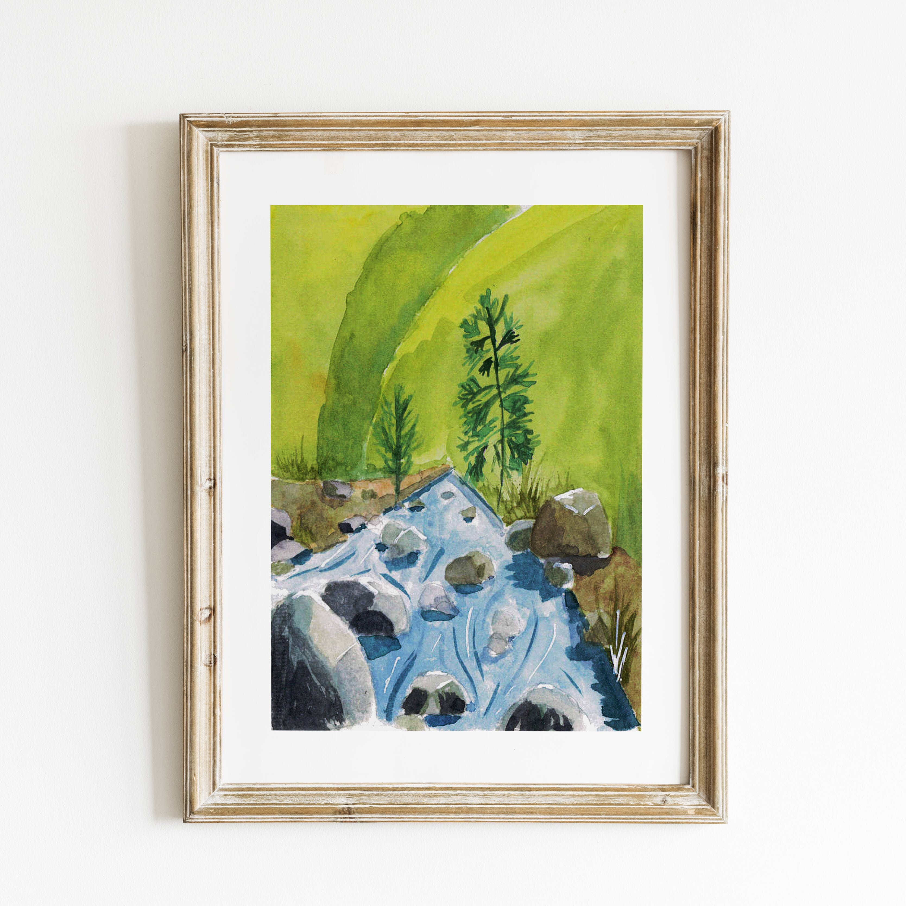

 

La rivière des Pluies est un petit joyau de verdures à l'est de Saint-Denis. On s'enfonce très rapidement dans la ravine et on change totalement d'environnement. La baignade peut se faire dans les nombreux petits bassins.

 
