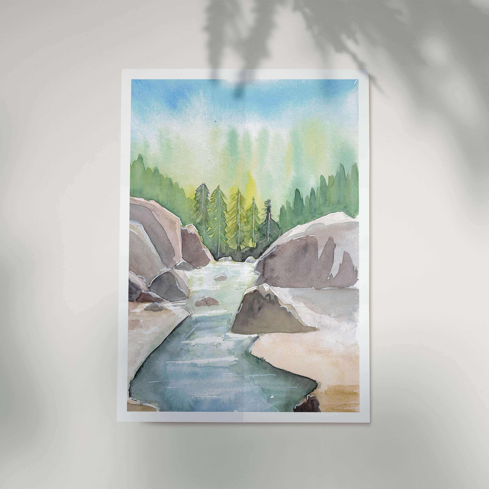

 

La rivière Fleurs Jaunes serpente au seins du cirque de Salazie, entre Salazie et Grand Ilet. On peut remonté le cours d'eau et ainsi voir de plus près des magnifiques cascades, des grottes et de superbes gorges
 

