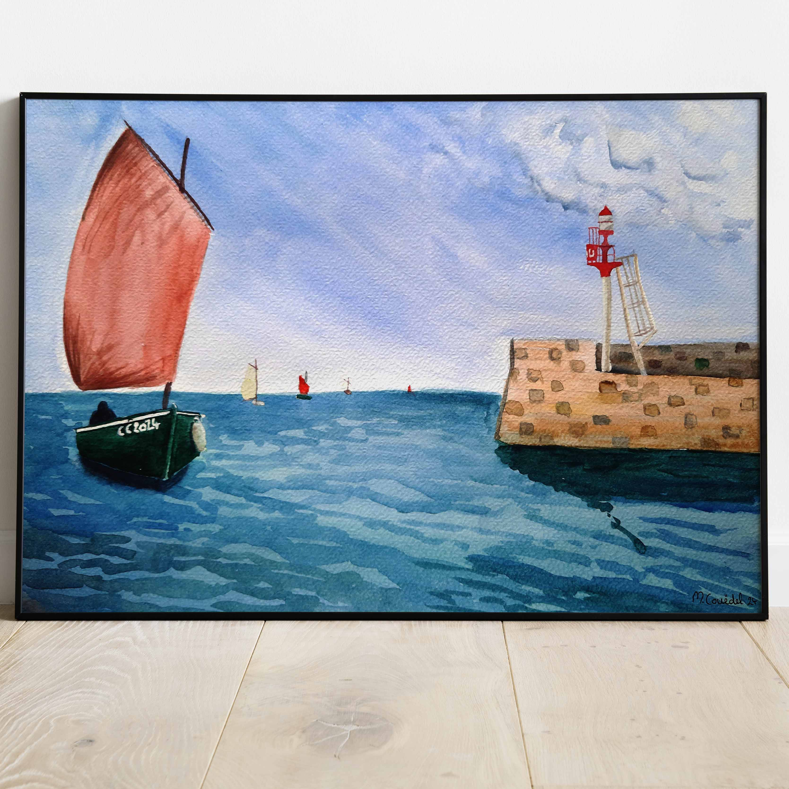

 
 
 
Pendant la première moitié du siècle, le misainier, ou canot breton à misaine, est le plus répandu des petits bateaux de pêche de Bretagne Sud. Les misainiers sont mis à l'honneur chaque année lors de la Fête de la digue au port de Brigneau.
 
 
Cette aquarelle se décline aussi en grand format :  
 
 
<a href="/aquarelles/paysages/bretagne/misaignier-brigneau/" title="Misainier rentrant au port">
  

                

                
Misainier rentrant au port

            
 
</a>

