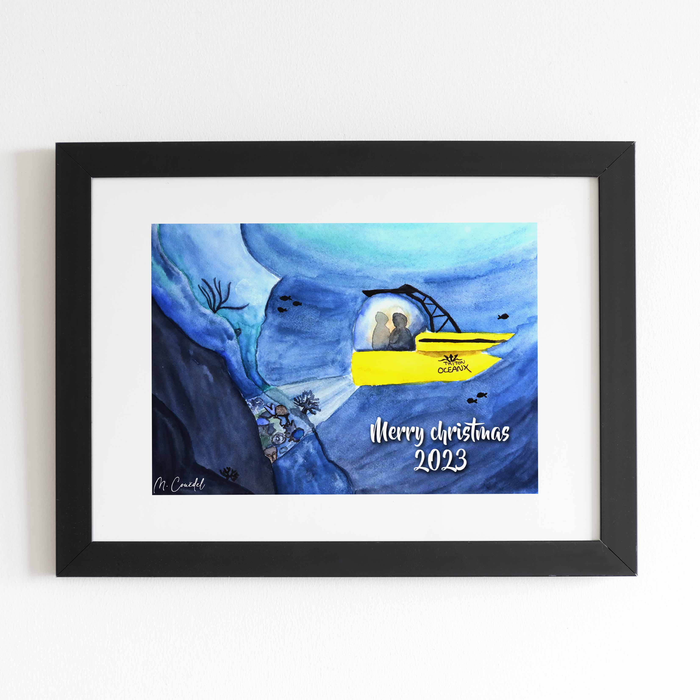
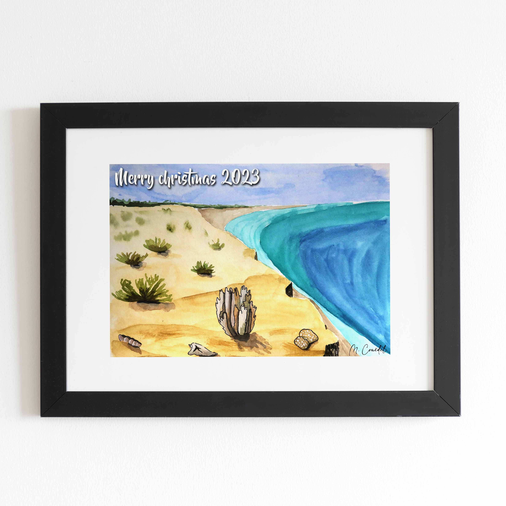
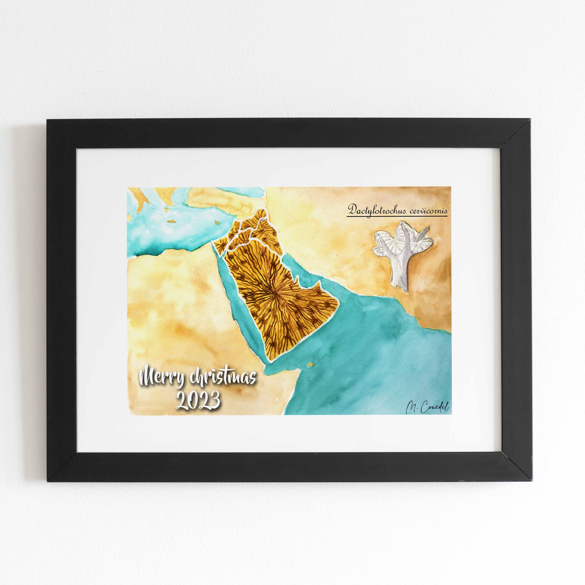
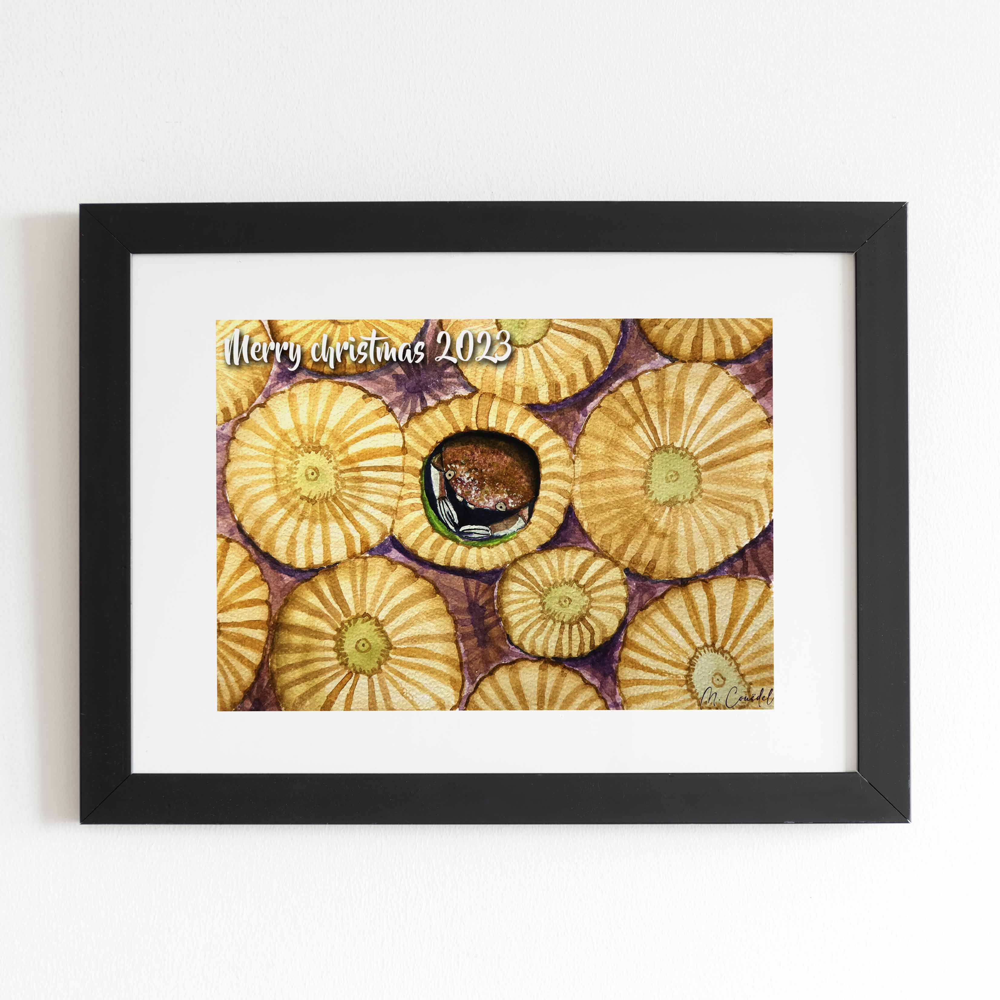
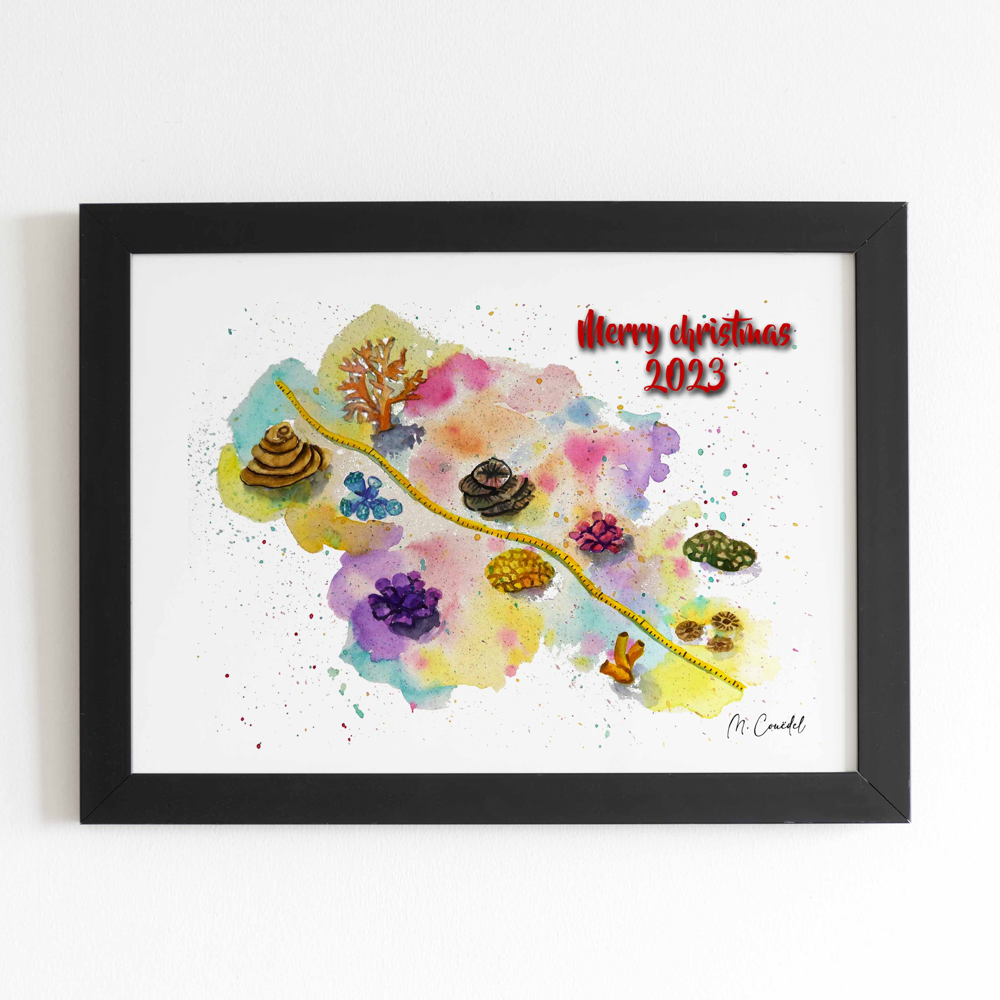
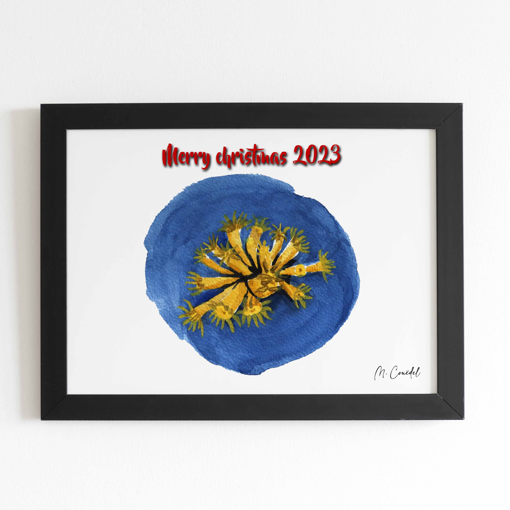
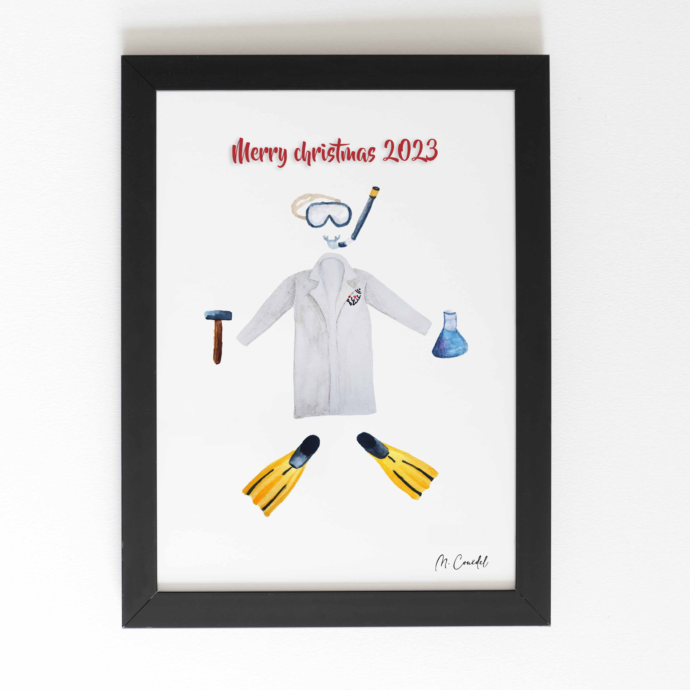
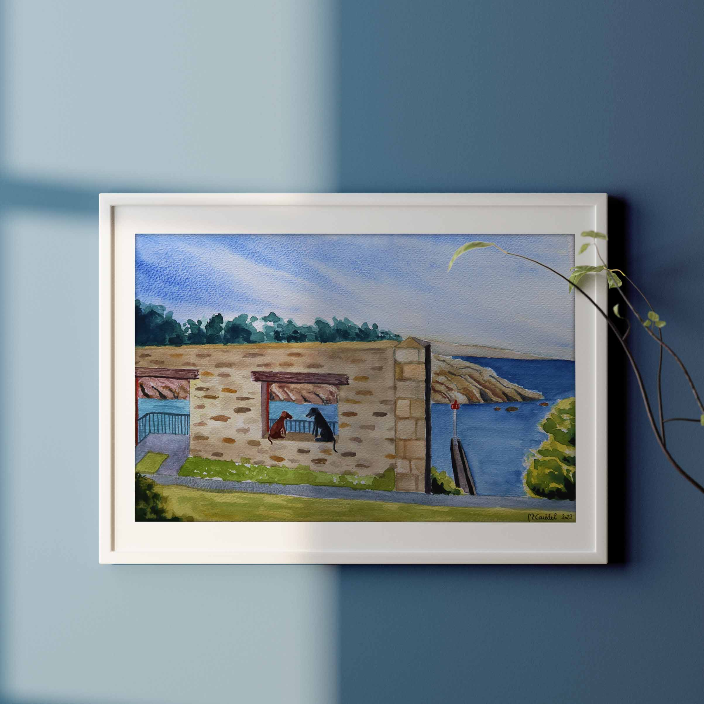
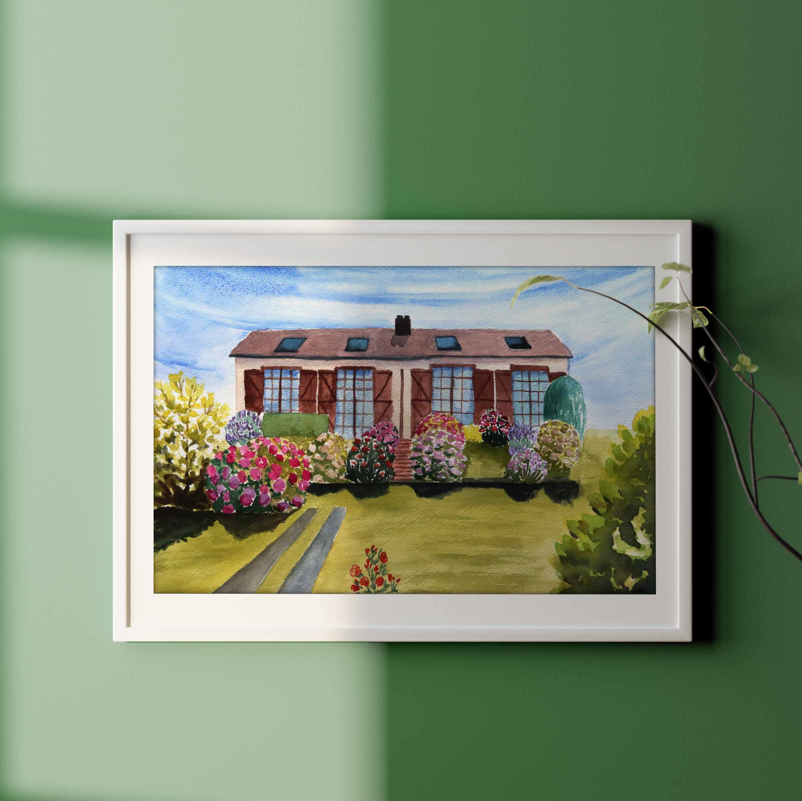

 

 
 

Je serais très heureuse de partager petits et grands moments de bonheur avec vous à travers mes aquarelles. Que ça soit pour annoncer un grand évènement ou bien faire plaisir à vos proches pour un anniversaire ou Noël 

 

     

N'hésitez pas à me contacter via les réseaux sociaux :

    

	<a id="facebook" href="//facebook.com/latelierdesembruns" target="_blank">
		<svg t="1657416223006" class="icon" viewBox="0 0 1024 1024" version="1.1" xmlns="http://www.w3.org/2000/svg" p-id="12360" width="40" height="40"><path d="M554.666667 850.688A341.376 341.376 0 0 0 512 170.666667a341.333333 341.333333 0 0 0-42.666667 680.021333V597.333333H384v-85.333333h85.333333v-70.570667c0-57.045333 5.973333-77.738667 17.066667-98.602666A116.309333 116.309333 0 0 1 534.869333 294.4c16.298667-8.746667 36.565333-13.994667 71.978667-16.256 14.037333-0.896 32.213333 0.213333 54.528 3.413333v81.066667H640c-39.125333 0-55.296 1.834667-64.938667 6.997333a31.018667 31.018667 0 0 0-13.397333 13.397334c-5.12 9.642667-6.997333 19.2-6.997333 58.368V512h106.666666l-21.333333 85.333333h-85.333333v253.354667zM512 938.666667C276.352 938.666667 85.333333 747.648 85.333333 512S276.352 85.333333 512 85.333333s426.666667 191.018667 426.666667 426.666667-191.018667 426.666667-426.666667 426.666667z" p-id="12361" fill=#2c4650></path></svg>
	</a>
	<a href="https://www.instagram.com/seas_sewing" target="_blank">
		<svg t="1679489655389" class="icon" viewBox="0 0 1024 1024" version="1.1" xmlns="http://www.w3.org/2000/svg" p-id="2759" width="40" height="40"><path d="M512 306.9c-113.5 0-205.1 91.6-205.1 205.1S398.5 717.1 512 717.1 717.1 625.5 717.1 512 625.5 306.9 512 306.9z m0 338.4c-73.4 0-133.3-59.9-133.3-133.3S438.6 378.7 512 378.7 645.3 438.6 645.3 512 585.4 645.3 512 645.3zM725.5 250.7c-26.5 0-47.9 21.4-47.9 47.9s21.4 47.9 47.9 47.9 47.9-21.3 47.9-47.9c-0.1-26.6-21.4-47.9-47.9-47.9z" p-id="2760" fill=#2c4650></path><path d="M911.8 512c0-55.2 0.5-109.9-2.6-165-3.1-64-17.7-120.8-64.5-167.6-46.9-46.9-103.6-61.4-167.6-64.5-55.2-3.1-109.9-2.6-165-2.6-55.2 0-109.9-0.5-165 2.6-64 3.1-120.8 17.7-167.6 64.5C132.6 226.3 118.1 283 115 347c-3.1 55.2-2.6 109.9-2.6 165s-0.5 109.9 2.6 165c3.1 64 17.7 120.8 64.5 167.6 46.9 46.9 103.6 61.4 167.6 64.5 55.2 3.1 109.9 2.6 165 2.6 55.2 0 109.9 0.5 165-2.6 64-3.1 120.8-17.7 167.6-64.5 46.9-46.9 61.4-103.6 64.5-167.6 3.2-55.1 2.6-109.8 2.6-165z m-88 235.8c-7.3 18.2-16.1 31.8-30.2 45.8-14.1 14.1-27.6 22.9-45.8 30.2C695.2 844.7 570.3 840 512 840c-58.3 0-183.3 4.7-235.9-16.1-18.2-7.3-31.8-16.1-45.8-30.2-14.1-14.1-22.9-27.6-30.2-45.8C179.3 695.2 184 570.3 184 512c0-58.3-4.7-183.3 16.1-235.9 7.3-18.2 16.1-31.8 30.2-45.8s27.6-22.9 45.8-30.2C328.7 179.3 453.7 184 512 184s183.3-4.7 235.9 16.1c18.2 7.3 31.8 16.1 45.8 30.2 14.1 14.1 22.9 27.6 30.2 45.8C844.7 328.7 840 453.7 840 512c0 58.3 4.7 183.2-16.2 235.8z" p-id="2761" fill=#2c4650></path></svg>
	</a>
    

 

 Aquarelles réalisées sur-mesures :

  
<ul>
    <li style="color:#C2274B; font-family: Georgia;font-size: 120%">Aquarelles au format   numérique :</li>
        
Trois aquarelles au format numérique pour illustrer les bijoux en écailles de poisson créer par Sophie de  <a href="https://babouni.fr/salty/" target="_blank"> Babou'ni </a>.

      

        

            

                

                
<i>Brama brama</i>

            

            

                

                
<i>Lutjanus vivanus</i>

            

            

                

                
<i>Lutjanus sebae</i>

            

        

       
 
    <li style="color:#C2274B; font-family: Georgia;font-size: 120%">Aquarelles avec impression sur du papier 300 gsm :</li>
         
Neuf aquarelles originales qui ont été numérisées puis mises en forme pour Noël avant d'être imprimées sur du papier 300 gsm. Chaque aquarelle illustre le domaine de recherches des doctorants du laboratoire de Francesca (<a href="https://www.instagram.com/habb_lab/" target="_blank">HaBB Lab</a>), qui m'a gentimment demandé de réaliser leur cadeau de Noël.

        

            

                

                
Cartographie des récifs profonds

            

            

                

                
Etude du récif fossile

            

            

                

                
Connectivité des Agariciidae dans la péninsule arabique

            

            

                

                
Etude des crabes Cryptochiridae

            

            

                

                
Etude des coraux noirs

            

            

                

                
Recouvrement et blanchissement corallien

            

            

                

                
Etude des coraux profonds

            

            

                

                
Etude les gorgones

            

            

                

                
Technicienne du labo

            

        

    <li style="color:#C2274B; font-family: Georgia;font-size: 120%">Aquarelles originales :</li>
        
Souvenir de vacances à offrir. Peint à partir d'une photo avec l'ajout des deux petits loulous sur le bord de la fenêtre. </a>.

      

        

            

                

                
Souvenir de vacances

            

        

       
 
       
Illustration des <a href="https://sites.google.com/view/locationsveuleslesroses/accueil" target="_blank">gîtes à louer</a> à Veules-les-roses (Normandie).</a>.

      

        

            

                

                
Gîtes normands

            

        

       
 
</ul>

